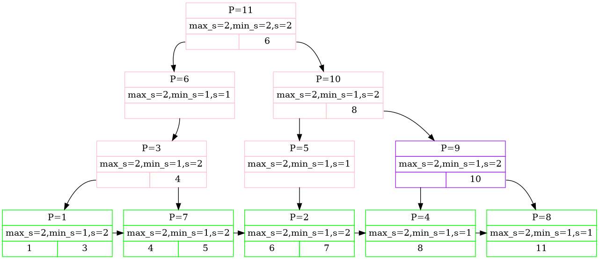
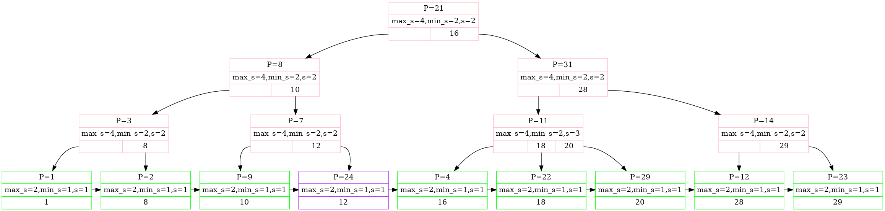
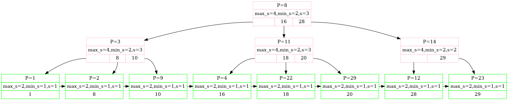
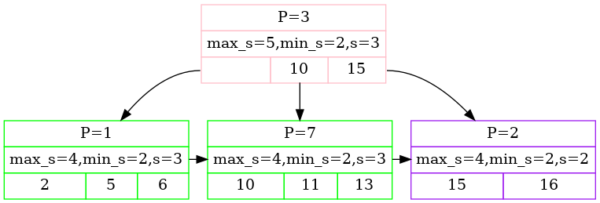
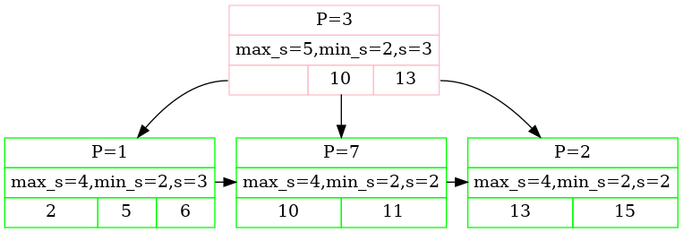

# CMU 445数据库系统项目
**为什么做**:

- 在结束完MIT的6.824项目, 实现了所谓的分布式分片数据库后, 笔者发现**整个项目完全不考虑数据存储层**, 即所有的实现是一个完备的分布式的**逻辑**数据库. 为更深入认识"一条SQL语句执行的全过程", 特别是在存储引擎层会发生的事, 开始了这个项目.
- 与MySQL的学习同步进行.
- 学习适用于C/C++生产环境的完整工具链 (特别是静态分析工具与测试框架.).


**做了什么**
- project#1: 实现服务DBMS的缓存池 (buffer pool). 实现使用**可扩展哈希** (extendable hashing) 维护数据库页 (page) 和缓存池帧 (frame) 的映射. 实现使用**K-LRU**替换算法将过时的帧替换刷入磁盘的数据库页.
- project#2: 实现支持并发插入/删除的B+树 (插入操作, 删除操作, **插入删除混合**操作均支持并发.). 实现服务**遍历查询**操作的迭代器.

**最终效果**
- project#1: 目前leader board排名464.
- project#2: 目前leader board排名398.


(目前仅进行基础优化, 打榜数据一般.)

## 并发B+树设计思想

Q: **第一次插入操作**因为需要做一些初始化操作有点特殊. 怎么设计支持并发?
> A: 并发的B+树正常情况下需要从根开始向下加锁, 而第一次插入所依赖的根节点还没有建立, 需要做相关的初始化, 一个简单的思路是用`bool is_empty_`维护该信息, 用一个mutex `mux_`保护它. 每次插入执行类似的逻辑:
```
auto insert() -> bool {
    bool is_empty = false;
    mux_.lock();
    is_empty = is_empty_;
    mux_.unlock();
    // ... 其余逻辑

    if (is_empty) {
        // ... 第一次插入的额外初始化逻辑
    }
    // ... 正常插入都需要走的逻辑
}
```
> 它的不足之处在于初始化操作发生的频率是非常低的, 而我们这样必须要从最悲观的角度出发, 每次插入都用一个mutex去获取成员变量`is_empty_`的最新值. **更重要的**, 线程A的insert进入了`if (is_empty)`分支, 如何抑制同时想执行insert的线程B也进入? 线程A何时置`is_empty_`?
因此目前实现使用**double-check locking**. 具体的, `is_empty`使用原子变量`std::atomic<bool>`保证读写原子.

```
private:
  std::atomic<bool> is_empty_;
  std::mutex mux_;
// ...
auto BPLUSTREE_TYPE::IsEmpty() const -> bool { return is_empty_.load(); }

auto insert() -> bool {
if (IsEmpty()) {
    std::lock_guard<std::mutex> lock(mux_);
    if (IsEmpty()) { 
      /*
        初始化逻辑. 主要为向buffer pool申请页, 向本页写入 (本次call提供的) 第一个KV.
        更新root page id供非初始化的操作使用.
      */
      is_empty_.store(false);
      return true;
    }
  }
}
```
> 这样所有尝试初始化的insert操作 (称insert^操作) 突破了外层`if`, 但因为mutex的scope是整个外层`if`, 只有一个这样的insert操作 (称insert_) 突破了内层`if`, 而其他的insert^会被mutex阻挡, 待insert_释放了mutex后均无法突破内层`if`. **而所有不尝试初始化的insert操作不会进入外层`if`**, 也就规避了 (绝大多数情况不需要的) 互斥锁.

Q: 那第一次插入操作和根有关. 有其他和根有关的并发问题嘛?
>A: OK, 根不光会「从无到有」, 还会发生其他形式的变更. 当访问根需要上写锁时, 如果没能成功获取到锁, 我们得想好处理措施. 具体地说, 考虑下面这个目前所有叶子均满了的2阶B+树 (内部/叶子节点均最多2个后代):

此时线程A insert 11, 线程B insert 2发生对root page#6的竞争, 设线程A成功了, 线程B势必要等待, 但然后呢? **等待谁?** 显然新的根不再是page#6.

因此线程B对根的上锁等待, 应是一种「等待检查」的机制. 因此目前实现使用**条件变量**处理「根锁」是否被释放这一共享信息. 获得「根锁」的线程在条件变量的保护下置flag; 在可以释放「根锁」时清flag同时唤醒. 这里因为都是读锁的竞争因此`signal`而非`broadcast`.

```
// 枚举类定义根状态.
enum class RootLockType : size_t { UN_LOCKED = 0, READ_LOCKED = 1, WRITE_LOCKED = 1 << 1 };
private:
  // 条件变量三元组.
  std::mutex mux_;
  std::atomic<size_t> root_locked_;
  std::condition_variable c_v_;
// ...
auto insert () -> bool {
  // 上面说的初始化判定, 操作.
  do {
    std::unique_lock<std::mutex> lock(mux_);
    while (root_locked_.load() != static_cast<size_t>(RootLockType::UN_LOCKED)) {
      c_v_.wait(lock);
      // 被唤醒就检查.
    }
   
    root_locked_.store(static_cast<size_t>(RootLockType::WRITE_LOCKED));

    // 本线程对根上写锁, 获得指向根页的指针.
    break;
  } while (true);
  // ...复杂的逻辑

  if (root 可以释放写锁) {
    // 可以释放根节点的时候唤醒. 未必在函数的末尾才开始对锁的逐个释放.
    mux_.lock();
    root_locked_.store(static_cast<size_t>(RootLockType::UN_LOCKED));
    c_v_.notify_one();
    mux_.unlock();
  }
}
```


Q: 插入还有什么问题嘛?
> A: 有一个问题会影响到B+树的可扩展性, 即一次insert操作会影响改变至多多少页面? 依旧考虑上面这个例子, 首先插入11, 我们必须从上向下上树高$h$个页的锁且**一个都不能放**. 同时这$h$个页面都会分裂还会有一个新的根, 这里就有$2h+1$个.
但早期实现忽略了一点: 当内部节点 (page#A分裂出right sibling page#B) 发生分裂时, page#A之前的孩子页有相当一部分需要更新其parent id! 当B+树**阶数比较大**而buffer pool的大小比较小就容易出问题: 本次insert**实际影响的页数**远远大于$2h+1$甚至大于整个buffer pool的大小.

解决方法是识别页面修改的生命周期. 即考虑page#4, 5这样需要改变parent id的页. 这样的页在最后修改完parent id后, **原则上就从buffer pool被替换然后刷入磁盘**. 即哪怕本次insert**实际影响的页数**非常大, 但需要同时在buffer pool的页数未必很大. 即在插入引发页面分裂时 (准确地说是叶子节点分裂引发了内部节点的级联分裂), 需要及时释放这类**横向的、本次insert仅修改一次的、可能海量的**页.


Q: 提到了**及时释放**这类横向的、本次insert仅修改一次的、可能海量的页.「释放」是什么意思? 遇到过什么坑嘛?
> A: 数据库页因为要被某些线程以`insert,remove,getvalue`语义访问, 形成线程对页面引用的引用计数. 具体来说一个buffer pool的frame#1承载了数据库页的page#a后可能被若干个线程同时上锁, 每个施加一些引用计数. 当引用计数归零时, buffer pool认为没有活跃的线程持续需要它, 于是根据替换算法可以将它刷入磁盘, frame#1可以承载其他数据库页了. **及时释放的含义是**, 在满足正确的前提下, 尽早让页的引用计数归零 (从而承载它的frame能载入新的数据库页).

> 这里有一个坑是: 线程对页面`unlatch`和`unpin` (即让本线程对它的引用计数--) 的顺序. 如果对page#A的unpin发生在unlatch (主要是写锁wlatch) **之前**, 单线程情况下以下事情是完全可能发生的:
```
  private:
    // 成员变量, 指向缓存池实例的指针.
    BufferPoolManager *buffer_pool_manager_;
  
  auto insert () -> bool {
    // 获取page#1 (frame#0承载), 并上写锁, fetch会++引用计数.
    Page *ptr1 = buffer_pool_manager_->FetchPage(1);
    ptr1->WLatch();
    // ...
    // 假设unpin前引用计数为1, 马上变为0. `false`表示不是dirty不需要写回.
    buffer_pool_manager_->UnpinPage(1, false);

    // ...
    /*
      现在可能发生的是: buffer pool需要替换页面承载请求的page#2.
      page#1的引用计数归零, 且满足被替换算法驱逐条件 (比如K次前访问时间最早).
    */
    Page *ptr2 = buffer_pool_manager_->FetchPage(2);
    // fetch了一个页并马上上锁一般是个好习惯, 但是这里会死锁!
    ptr2->WLatch();

    ptr1->WUnLatch();
  }
```
> 上面`ptr2->WLatch()`行会导致死锁! 因为我们所有的读/写锁上/解锁表面上是对页page#x进行的, **但实际上是对buffer pool直接管理的帧frame#x进行的**! frame#0在fetch page#1后上锁, 很晚才解锁; 在frame#0 (处理可能的对page#1刷盘后) fetch page#2时已经处于被写锁锁定状态, 而`ptr2->WLatch()`试图给它再上层写锁!
再总结一下, 如果用`(`表示写锁的上锁, `)`表示解锁, 对同一个frame#1而言, 写锁操作序列应形如$(_{1})_{1}(_{1})_{1}$而非$(_{1}(_{1})_{1})_{1}$.
如果像上述**错误地先`unpin`再`unlatch`**, 则正确的$(_{1}(_{2})_{2})_{1}$和错误的$(_{1}(_{1})_{1})_{1}$**都有可能出现且没法区分** (这个坑GDB调试辅助LOG日志才证实的)!
那反过来 (能不能) 证明**先`unlatch`再`unpin`** 就没问题?
- 哪怕多线程情况, 刚`unlatch`的瞬间因为pin count依然为正所以不用担心被驱逐; 对应的frame#x也就**不会再承载一个新的page#并上锁**, 从而出现$(_{1}(_{1})_{1})_{1}$式死锁.
- 需要注意的是`unpin`能不能让frame#x的引用计数成功归零? 如果不能, 那最坏的情况就是frame#x因为引用计数原因一直无法驱逐目前承载的page#, 造成类似内存泄漏的情况 (**可以**被其他线程用因为没被`latch`, 但无法被buffer pool GC因为引用计数. 但这显然没不确定性的死锁要好一些). 于是我们需要维护线程对frame#x施加的引用计数以便最终能**恰好**`unpin`自己作用的部分.
```
Page *ptr1 = buffer_pool_manager_->FetchPage(1);
ptr1->WLatch();
// ... phase1: 一些对对应frame#修改的逻辑.
ptr1->WUnlatch();

// ...这里没有做unpin!

ptr1 = buffer_pool_manager_->FetchPage(1);
ptr1->WLatch();
// ... phase2: 欸, 本线程在phase1修改还不够, 还得再修改一部分.
ptr1->WUnlatch();

// ...于是这里需要多次unpin!
```
> 因为目前实现存在上述这样代码, 如插入11时page#4需要面临的操作, 目前实现的过程如下:


- page#4上写锁, 分裂出right sibling page#8, 数据搬运; page#4不知道其parent page#5也发生了分裂; 于是解锁.
- 往回走发现page#5也分裂出right sibling page#9. **page#4, page#8需要改变指向的parent id**, **于是page#4需要重新上/解锁改变parent id**!

一个更好的 (但目前没实现的) 方案是**单个线程对所有涉及的页, 恰好上/解一次锁**.

Q: remove操作遇到过什么坑嘛?
> A: remove操作实现中面临的**第一个坑**是: 假设要删除某个叶子页面的第一个key. 我们要不要维护该页面对应的parents的记录? 即再次考虑这个B+树, 假设我们要删除key#10, 最终定位到了叶子页面page#8. 而**page#9关联page#8的key为key#10**, **要修改page#9嘛**?

开始看了不少B+树的图解, 笔者 (错误地) 认为内部节点的key应该是对应子树所有key的**下确界** (即应该是紧致的). 这样至少有一个好处: 要求key unique的情况下, insert操作存在fast path即**如果在内部节点中存在就能提前以失败返回**. 但后来面临一系列非常奇怪的问题让我最终放弃了它.

即单纯的删除叶子节点的KV (哪怕是其第一个) 而不引起页面合并的情况, **不需要修改其对应的parents的记录** (也可能就是不应该). 更确切地说, 内部节点的key应该是对应子树所有key的**下界**就够了 (不需要是紧的下确界).

Q: remove操作还有什么难点嘛?
> A: 与insert导致的「级联分裂」类似, **remove导致的「级联合并」比较烦人**, 程度更甚. 分裂可以指定分裂的为right sibling (最主要的原因是本实现的叶子节点是`->`的单链表), **但合并时另一半的位置未必是确定的**. 考虑下面的B+树要删key#12.

显然两个siblings均不能借 (**况且page#4也不是它的sibling**). 于是page#7和**right sibling** page#3合并, page#8又要和**left sibling** page#31合并. **而这里page#7和page#8都只有一个合并选择**! 这种级联合并每层合并的对象不定是left或right sibling.

而且对于同时为内部节点的根节点还有度数约束, **导致旧的根可能过时** (比如上面的page#21就过时不需要了).
实现思路: 从根向下搜索时我们还需要维护一个指示路径的栈`st`. 例如删除key#12在最后落到page#24前, 需要走`page#21->page#8->page#7`的内部节点路径, 栈可等价描述为`{{21,0},{8,1},{7,1}}`. 其中`{21,0}`表示走了page#21的第`0`个 (左起) 分支, 以此类推. 
当`st[i]`对应的page#x考虑要被合并时, 考察对应的second值: 这能标明page#x有没有left/right sibling (肯定至少有一个, **没有的话表明根同时是叶子节点**!). 我们合并, 对**合并两者的parent**`st[i - 1]`对应的页做一些book-keeping (parent页至少要删除一个条目).

> 除了合并问题, 如果remove导致了「借」也会比较麻烦, 需要在parent页上对key做book-keeping. 如对下面的B+树删除key#16, 导致向left sibling借其最大的key#13, 因此公共的parent page需要更新对应的索引key.

