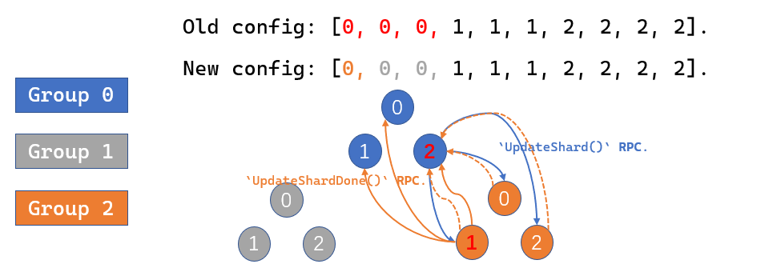

# MIT 6p824分布式系统项目
**为什么做**:
- 多年前就声名远播, 笔者认为现在稍微有空能做一下了.
- **熟练掌握一门副语言** (Golang. 主语言当然还是C/C++).
- 入门一个重要, 难, 经常耳闻但个人知识不成体系的领域.


**做了什么**
- lab#2: 从头到尾忠实地实现Raft算法. 需要充分考虑到单点宕机故障, RPC心跳包超时等实际问题.
- lab#3: 使用Raft算法构建集中式数据库.
- lab#4: 使用Raft算法构建分布式的**分片**数据库. 支持coordinator调整集群与数据片的映射关系.

**最终效果**
所有lab (多次) 稳定连续通过10000次 (笔者认为bug-free了, 可惜本课程不对外开放oj, 无法得知在官方的测试环境中的正确性与本实现的水准.).

Q: 为什么要用raft? raft有什么缺点嘛? 对数据一致性的要求就非得这么高嘛, 相对更简单的Redis主从结构甚至集群结构不行嘛?
> A: 根本原因是这个大lab有4部分, 其中lab#2要求忠实地实现raft共识算法 (悲). raft的确存在一些可能的缺陷:
- leader节点的负担太重了: 像zookeeper内部共识用的zab原子广播, 让leader节点负责写和同步, **众多的follower节点可以各自负责处理client的读请求**. 它随着集群的扩展是能提高吞吐量的. 但raft里对读请求依然需要leader广播, 达成majority日志持久化. 因此随着集群内部replica数目增加, **的确可靠性增加了, 但leader的RPC开销显著增加**, 吞吐量是减小的.
- **raft不像paxos支持"乱序commit"**. raft的log commit机制有一些性质, 基于下标 (index) 和日志对应任期 (term) 进行选举, follower日志的commit. 因此如果index为 $[i]$ 的日志条目没有被append, index为$[i+1]$的条目也无法被append, 更不能被commit. 这在网络质量比较差, 且`appendentry` RPC比较频繁, 每个这样的RPC携带日志条目不多的情况下是可能发生的. 表现上非常像TCP的"Head-of-Line blocking"队头阻塞. TCP发生这种问题的根源是它字节确认且传输存在MTU/MSS; raft存在这种问题的根源是**协议要求的日志性质** (成也萧何败也萧何?).

Q: 实现raft算法遇到过什么坑吗?

> A: 选举阶段, 开始就有一个不好的设计. 我们考虑raft文章中的server状态机:

有一个现实的问题是, 当leader发送heart beat RPC但没得到足量的积极回应 (比如出现了partition, 且这个倒霉的leader在minority的一侧), **这个leader server应该怎么办**? 显然从上帝视角来看, 往后的一段时间不能继续是leader, 因此最开始的实现我选择让leader退化到follower (我们称呼为server#j), 代码大致如下:
```Golang
 rf.mu.Lock() 
 recognition_cnt := 1       // 自己的一票
 close(reply_success_chan) 
 for tmp := range reply_success_chan { 
 	if tmp { 
 		recognition_cnt++ 
 	} 
 } 
  
 if recognition_cnt*2 <= len(rf.peers) { 
 	// DPrintf("server %v step down to follower", rf.me) 
 	rf.state = Follower 
 	rf.persist() 
  
 	rf.mu.Unlock() 
 	return 
 } 
 rf.mu.Unlock() 
``` 
现在有什么问题? server#j倒计时结束后成为candidate, 开始term++, 广播RPC求票. 但是永远不可能成功: **因为它在minority的partition中**, 永远求不到足量的票, 也没成功当选的新leader去抑制它的RPC求票. 它一遍又一遍地倒计时后求票, 把term任期变量抬的很高, 下一次partition问题解决后, **成功选举出一个leader的term会变得非常大**, 出现**惊群现象**.
> 这个问题的根源还是没忠实地实现状态机: leader $\rightarrow$ follower的条件严格是遇到一个RPC交换时, term成员更大的server, **不应该在发现票不足数后, leader主动地退让**. 换句话说, **上帝视角下我们是允许整个集群同时存在多个leader的**, 但它们的term各不相同, 且仅term最大的那个合法, 这就够了.

Q: 还遇到过哪些坑和状态机有关?
> A: 还遇到一个坑. 我们该怎么理解"discover server with higher term"这个条件? 它可能发生在任意时刻, 一个笔者最开始忽视的时刻为 **`leader`在广播append RPC中途可能退化为`follower`**.
```Golang
for peer_id := range rf.peers {
	// 考虑给自己以外的本集群内所有server发送RPC.
	if peer_id == rf.me {
		continue
	}
	wg.Add(1)
	go func(id int) {
		defer wg.Done()
		exit_loop := false
		// ...
		/*
		准备appendentry RPC的args.
		RPC丢包的话超时重传.
		*/
		for !exit_loop {
			reply := AppendEntriesReply{Success: false, Term: rf.current_term}
			call_chan := make(chan bool, 1)
			ok := false

			go func(idd int) {
				ok = rf.peers[idd].Call("Raft.AppendEntries", &args, &reply)
				if ok {
					call_chan <- true
					return
				}
			}(id)
			
			// 设定30ms的timeout, go-routine fire同时启动.
			ctx, cancel := context.WithTimeout(context.Background(), 30*time.Millisecond)
			select {
			case <-ctx.Done():
			// 倒计时打满分支
			case <-call_chan:
			// go-routine在倒计时之前写入了buffered channel
			}
			cancel()
			/*
			根据 ok变量和reply判断RPC通信成功与否, 请求是否如leader预期.
			一种特殊情况是RPC通信成功了, 但对端endpoint因为term更大明确拒绝.
			这个上下文是有互斥锁的, 但unlock的分支很多这里就省略了.
			*/
			if ok && !reply.Success {
				if rf.current_term < reply.Term {
					rf.current_term = reply.Term
					rf.state = Follower
					rf.persist()
					// 如果exit_loop不更新为true表明RPC没能在timeout内被响应, 因此继续走`for !exit_loop`循环.
					exit_loop = true
					reply_success_chan <- reply.Success
				}
			}
		} (peer_id)
	}
}
```
> 以上代码的问题在于: `rf.current_term = reply.Term`, `rf.state = Follower`, leader在接收到关于append entry RPC的明确拒绝时, **单单改变成员变量不调整控制流是错误的**. 一旦退化到follower后要立即停止append entry RPC的广播, 因此这个`if` 分支需要完整地退出`for peer_id := range rf.peers`整个循环! 如果不这么做, 对于`for peer_id := range rf.peers`中后启动的go-routine, 它们认为**实际上是过期的leader**, term非常新, 于是这些follower在一定情况下会删除自己的日志条目 (具体参见论文AppendEntries RPC impeachmentation的第3点.).

Q: 你上面这个`ok` bool变量有没有问题? 在go-routine A定义并多出使用, A又启动了一个新的go-routine B, B会修改`ok` (因为作为RPC通信成功与否的的返回值), 有没有数据竞争?

> A: 的确上面这个代码在解决**错误的状态机转换**问题后, 的确还存在数据竞争问题.
```
WARNING: DATA RACE
Write at 0x00c00016419f by goroutine 107:
  6.5840/raft.(*Raft).sendAppendEntries_broadcast.func1.1()
      /home/yhqian/archives/LABS/MIT_6p5840/src/raft/raft.go:569 +0x11c
  6.5840/raft.(*Raft).sendAppendEntries_broadcast.func1.3()
      /home/yhqian/archives/LABS/MIT_6p5840/src/raft/raft.go:576 +0x41

Previous read at 0x00c00016419f by goroutine 104:
  6.5840/raft.(*Raft).sendAppendEntries_broadcast.func1()
      /home/yhqian/archives/LABS/MIT_6p5840/src/raft/raft.go:592 +0xa52
  6.5840/raft.(*Raft).sendAppendEntries_broadcast.func2()
      /home/yhqian/archives/LABS/MIT_6p5840/src/raft/raft.go:634 +0x41
```
> 具体来说以下时间线的事情是完全可能发生的:
- go-routine A定义变量ok `ok := false`; 开启go-routine B, B可能赋ok为true.
- A启动了一个30ms的上下文持续阻塞在这里, 然后上下文到期了, A顺序执行.
- A因为上下文到期了判定丢包, 分支里做一些简单但不是原子的处理; **与此同时** (即进入了判定分支, 正在处理逻辑), go-routine B有了结果, 改了**ok**.
> 这里问题的核心是, 无法对RPC的时延做出一个很好的估计 (总会有离群值超出设定的上下文时长), 然后面对离群值时出现先读后写竞争.
解决方式很简单: go-routine A在启动go-routine B后不再直接使用`ok`变量. 和`ok`同时定义`tmp_ok`变量, **它只在严格的倒计时上下文被修改**. 后面的分支判断全用`tmo_ok`.
```Golang
ctx, cancel := context.WithTimeout(context.Background(), 30*time.Millisecond)
select {
case <-ctx.Done():
case <-call_chan:
	tmp_ok = true
}
cancel()
```

Q: raft实现中你遇到最大的困难是什么?
> A: 这个问题有一定的背景. 参见课程的蓝图[架构Api](http://nil.csail.mit.edu/6.5840/2023/notes/raft_diagram.pdf).

简单描述下这个非常隐蔽的问题 (**和go-routine的调度有关**): 当我们引入红色的快照系统后, 怎么处理新的`applyCh()`事件和旧的(关于append log)的`applyCh()`事件?
和实现有关: **如果这两个事件用同一个不会并发的函数实现, 通过不同传参触发那比较好弄**; 
但我的实现存在并发问题, 于是: **这里事实上存在一个同步关系, 需要我们自行保证**.

> 直到做到lab#4才找到这个问题. 考虑到给raft增加快照之后. 实质是raft需要按顺序地**commit**和**apply**, **commit**因为raft在算法上已经给我们保证了但是应用是对raft透明的, **怎么保证apply的顺序性**?
如果一个follower server (我们叫server#x) 很久之前崩溃了, 它现在启动且落后其他server很多了. 因为只有这一台机器崩溃了, 其他的servers依然构成majority能commit相当多的日志. 现在的问题是: 怎么让server#x快速赶上其余的server? 依然是基于appendentry, server#x自己commit, 最终逐个apply给应用层吗?
一个更好的方法是让server#x从leader处**直接安装快照**, 让它一次性在视图上与至少majority的server一致.
如下图, 在term#0, server#0持续为leader, 而server#4初期短暂在线后持续下线, 最终上线.

站在server#0的视角下, 蓝色的条目都被自己commit了所以能打包成快照, 维护快照的`Last_included_index/Last_included_term`, 即`[0...Last_included_index+1]`的完整slice之前作为log的slice, 现在整体作为snapshot.
server#0因为维护所有follower的nextIndex和matchIndex数组因此能注意到某些滞后的server (**比较数组中该server的项与Last_included_index即可**), 遇到这样的server, leader发送snapshot (目前的实现, 快照是全量的这是个不小的缺憾), 通过RPC.
- 之后的follower接受到快照后更新一些信息 (因为每个server都有快照, 只是leader能发送, 其他的只能被动接收) 后RPC返回. **有一些耗时的操作笔者用go-routine异步进行** (最主要的是apply到应用层)
- leader的snapshot RPC成功后, 更新对应follower的数组项 (不然**日志的追加** append entry RPC无法进行).
```Golang
func (rf *Raft) prepare_and_send_snapshot(server int) bool {
	rf.mu.Lock()
	// 忠实履行原论文. 唯独简化分块传输.
	args := InstallSnapshotArgs{
		Term:                rf.current_term,
		Leader_id:           rf.me,
		Last_included_index: rf.last_include_index,
		Last_included_term:  rf.last_include_term,
		Data:                rf.snapshot}
	reply := InstallSnapshotReply{}
	rf.mu.Unlock()

	ok := rf.sendInstallSnapshot(server, &args, &reply)
	if !ok {
		return false
	}

	rf.mu.Lock()
	defer rf.mu.Unlock()
	if reply.Term > rf.current_term {
		rf.state = Follower
		rf.vote_for = -1
		rf.current_term = reply.Term
		rf.persist()
		return false
	}
	if rf.current_term != args.Term {
		return false
	}
	/*
	快照对应的日志下标为[0, rf.last_include_index],
	因此下一个插入理论为rf.last_include_index+1.
	*/
	rf.next_index[server] = max(rf.next_index[server], rf.last_include_index+1)
	rf.match_index[server] = rf.next_index[server] - 1
	return true
}

func (rf *Raft) sendAppendEntries(server int, args *AppendEntriesArgs, reply *AppendEntriesReply) bool {
	ok := rf.peers[server].Call("Raft.AppendEntries", args, reply)
	return ok
}
```
- leader将snapshot以外的entry以append entry RPC发给这个server, 如上图的`1|b<-2`.
在leader的视角下, `prepare_and_send_snapshot`和`sendAppendEntries`两个RPC严格先后执行: 第一个结束了第二个才执行. **但是**follower响应RPC时, 都需要apply, 而apply是异步执行的.
```Golang
func (rf *Raft) InstallSnapshot(args *InstallSnapshotArgs, reply *InstallSnapshotReply) {
	rf.mu.Lock()
	defer rf.mu.Unlock()

	reply.Term = rf.current_term
	if rf.current_term > args.Term {
		return
	}
	if rf.current_term < args.Term {
		rf.state = Follower
		rf.current_term = args.Term
		rf.vote_for = -1
		rf.leader_id = -1
	}
	rf.reset_election_timer()
	if rf.commit_index > args.Last_included_index || rf.last_include_index >= args.Last_included_index {
		return
	}
	// 一些follower安装snapshot的逻辑.
	rf.log = []LogEntry{{Term: args.Last_included_term, Data: nil}}
	
	rf.last_include_index = args.Last_included_index
	rf.last_include_term = args.Last_included_term
	rf.commit_index = args.Last_included_index
	rf.snapshot = args.Data

	rf.last_applied = args.Last_included_index
	Messages := ApplyMsg{
		SnapshotValid: true,
		Snapshot:      args.Data,
		SnapshotIndex: args.Last_included_index,
		SnapshotTerm:  args.Last_included_term}
	// go-routine异步交付到应用层.
	rf.apply_lock.Lock()
	go func() {
		// rf.apply_lock.Lock()
		rf.applyCh <- Messages
		rf.apply_lock.Unlock()
	}()

	rf.persist()
}
```
- 早期实现版本中, `applyLogs`只会在特定时刻触发. **follower顺序响应prepare_and_send_snapshot和sendAppendEntries时**, 分别先后开启go-routine. **但是我们不能保证先开启的go-routine会先执行** (一切的问题都源于这个想当然的假定)!!!!
```Golang
// apply the committed logs.
func (rf *Raft) applyLogs() {
	rf.mu.Lock()
	defer rf.mu.Unlock()

	for i := rf.last_applied + 1; i <= rf.commit_index; i++ {
		rf.applyCh <- ApplyMsg{
			CommandValid: true,
			Command:      rf.log[i].Data,
			CommandIndex: i,
		}
		DPrintf("commit cmd by server %v. index/data: %v/%v", rf.me, i, rf.log[i].Data)
		rf.last_applied = i
	}
}
// example AppendEntries RPC handler.
//
// if `args.Entries` is empty, it is a heartbeat call.
// `index` starts from 1, and should subscripts `rf.log` with [0].
// follower apply的逻辑.
func (rf *Raft) AppendEntries(args *AppendEntriesArgs, reply *AppendEntriesReply) {
	/// ...
	// Receiver implementation (5)
	if args.Leader_commit > rf.commit_index {
		rf.commit_index = min(args.Leader_commit, len(rf.log))
		go rf.applyLogs()
	}
	/// ...
}
// leader apply的逻辑.
func (rf *Raft) sendAppendEntries() {
	for log_index := rf.get_nxt_log_index() - 1; log_index > rf.commit_index; log_index-- {
		cnt := 1
		if rf.log[log_index].Term == rf.current_term {
			for peer_id := range rf.peers {
				if peer_id != rf.me && rf.match_index[peer_id] >= log_index {
					cnt++
				}
			}
			if 2*cnt > len(rf.peers) {
				rf.commit_index = log_index
				DPrintf("server %v as leader, updates commit index to %v", rf.me, rf.commit_index)
				go rf.applyLogs()
				break
			}
		}
	}
}
```

我们再看这个图. b的最新值是`2`. 因此对于后开始的, 对应append `1|b<-2`这个log entry的go-routine我们严格要求它后执行: 如果先执行它, 再执行对应的snapshot的话, `b:2`会被snapshot覆盖 (**这个问题是疯狂打印高精度日志才发现的**)!

如何解决这个问题? 这里笔者注意到一点: **如果出现这种"snapshot"和"append log"并发的情况, 我们严格地需要"snapshot"先响应完成再响应"append log"**. 分析出后笔者使用**条件变量+专用互斥锁**解决这个问题 (因为也只需要同步这两个, 不需要考虑扩展性).
使用`rf.apply_lock`这把专门的互斥锁处理apply. 这样只需要保证`InstallSnapshot()`内的go-routine率先获得这个锁就行了. `InstallSnapshot()`进入就获取全局锁, 修改`rf.last_applied`, `rf.commit_index`, 同时`applyLogs()`因为条件变量wait. 等到被唤醒时 (这就保证了后发生), 会等待`rf.apply_lock`专门锁的释放.
```Golang
// apply the committed logs. only use a single go-routine.
// protect with mutex when `append` into buffer. when the `append` into buffer operation
// is ended, release the lock so it can do other operations (response to other RPCs.)
func (rf *Raft) applyLogs() {
	rf.mu.Lock()
	defer rf.mu.Unlock()
	for !rf.killed() {
		Messages := make([]ApplyMsg, 0)
		// 在接收leader的snapshot后 (启动它的go-routine前), rf.last_applied, rf.commit_index会更新到一样大. 于是cv进入wait.
		if rf.last_applied < rf.commit_index {
			for i := rf.last_applied + 1; i <= rf.commit_index && i <= rf.last_log_index(); i++ {
				Messages = append(Messages, ApplyMsg{
					CommandValid: true,
					Command:      rf.log[i-rf.last_include_index].Data,
					CommandIndex: i,

					SnapshotValid: false,
				})
				rf.last_applied = i
			}
			rf.mu.Unlock()

			rf.apply_lock.Lock()
			for _, msg := range Messages {
				rf.applyCh <- msg
			}
			rf.apply_lock.Unlock()

			rf.mu.Lock()
		} else {
			rf.apply_cond.Wait()
		}
	}
}

// example AppendEntries RPC handler.
//
// if `args.Entries` is empty, it is a heartbeat call.
// `index` starts from 1, and should subscripts `rf.log` with [0].
func (rf *Raft) AppendEntries(args *AppendEntriesArgs, reply *AppendEntriesReply) {
	/// ...一系列复杂逻辑, 包括对log的追加, 最后unlock.
	if args.Leader_commit > cur_commit_index {
		rf.mu.Lock()
		rf.commit_index = min(args.Leader_commit, last_log_index_2)
		if rf.last_applied < rf.commit_index {
			rf.apply_cond.Signal()
		}
		rf.mu.Unlock()
		// go rf.applyLogs()
	}

	reply.Success = true
}
```

> 在日志debug后, 笔者更进一步地查看了golang的文档 (主要和[内存模型有关](https://go.dev/ref/mem), 同时也深化了C++11关于memory order的一些知识), 与这个bug直接有关的内容如下 (均摘录于上面的链接):

>  The go statement that starts a new goroutine is synchronized before the start of the goroutine's execution.

> The exit of a goroutine is not guaranteed to be synchronized before any event in the program. For example, in this program:

> If the effects of a goroutine must be observed by another goroutine, use a synchronization mechanism such as a lock or channel communication to establish a relative ordering.

Q: lab#3的KV数据库做了什么? 架构大概是什么样的?
> A: 架构如之前描述的图所示:

在底层的raft基础上搭建应用层的replica state machine. `clerk machine`向外暴露三个接口 (以下摘自[课程指南](https://pdos.csail.mit.edu/6.824/labs/lab-kvraft.html)): 

>  Clients will interact with your key/value service in much the same way as Lab 2. In particular, clients can send three different RPCs to the key/value service:
- `Put(key, value)`: replaces the value for a particular key in the database
- `Append(key, arg)`: appends arg to key's value (treating the existing value as an empty string if the key is non-existent)
- `Get(key)`: fetches the current value of the key (returning the empty string for non-existent keys)
> Keys and values are strings. Note that unlike in Lab 2, neither Put nor Append should return a value to the client. Each client talks to the service through a Clerk with Put/Append/Get methods. The Clerk manages RPC interactions with the servers.

以`Put(key, value)`方法为例, 具体发生一系列事情:
- `clark machine`调用`Put(key, value)`方法, 每个clark记录所有replica state machine于`servers`, 同时记录对应的leader下标于`leader_id` (raft层对应leader的上游就是RSM中的leader, **可能是stale的**). 向`servers[leader_id]`发RPC (即最顶上的$\textcolor{blue}{blue}$边).
	```Golang
	type Clerk struct {
		servers []*labrpc.ClientEnd
		// You will have to modify this struct.
		leader_id int64
		me        int64		// 考虑有多个clerk实例.
		seq       int64
	}
	```
- 被RPC调用的RSM要"刺探"下层的raft实例, 通过图中所示的`start()`方法. 刺探的目的为: 
	- 验证对应的下层raft实例的确为leader这样才能写入. 否则RPC返回失败, clerk更新`leader_id`找另一个RSM发起RPC.
	- 如果的确是leader, 需要把RPC参数解析后在raft层达成共识. **raft层向上apply时才返回RPC的reply**.

- 为抑制"time-travel"问题, 每个RSM维护`kv.client_cache_table`哈希表, **表示对每个`clark`成功响应的最大任务号**. 这要求clerk在收到RPC成功的回应后, 执行成员的`seq++`操作. 如果RSM收到了过时的RPC请求 (**之前明确成功回复过**), 提前终止 (考虑下面的第一个`return`).
	```Golang
	type Op struct {
		// 命令日志化的结构.
		// Your definitions here.
		// Field names must start with capital letters,
		// otherwise RPC will break.
		Is_get       bool
		Is_putAppend bool
		Client_id    int64
		Seq          int64
		Key          string
		Value        string
		Put_orAppend string
	}

	func (kv *KVServer) PutAppend(args *PutAppendArgs, reply *PutAppendReply) {
		// Your code here.
		kv.mu.Lock()
		if args.Seq_num <= kv.client_cache_table[args.Client_id] {
			reply.Err = OK
			kv.mu.Unlock()
			return
		}
		cmd := Op{Put_orAppend: args.Op, Is_putAppend: true, Seq: args.Seq_num,
			Client_id: args.Client_id, Key: args.Key, Value: args.Value}
		_, _, is_leader := kv.rf.Start(cmd)
		if !is_leader {
			reply.Err = ErrWrongLeader
			kv.mu.Unlock()
			return
		}

		ch := make(chan Op, 1)
		kv.wait_Ch[args.Client_id] = ch
		kv.mu.Unlock()
		// 这里注意下面execute()函数的`if op.Is_get`分支.
		select {
		case op := <-ch:
			kv.mu.Lock()
			delete(kv.wait_Ch, op.Client_id)
			kv.mu.Unlock()
			if cmp_command(cmd, op) {
				reply.Err = OK
				DPrintf("kv server %v: ret <%v, %v> (p/a) kv: <%v, %v>",
					kv.me, op.Client_id, op.Seq, op.Key, op.Value)
				return
			} else {
				reply.Err = ErrWrong
				return
			}
		case <-time.After(time.Duration(500) * time.Millisecond):
			kv.mu.Lock()
			delete(kv.wait_Ch, args.Client_id)
			kv.mu.Unlock()
			reply.Err = TimeOut
			return
		}
	}
	```

- 在底层的raft commit后并通过channel向上层apply后, `ch`被写入 (注意到这里的`start()`有互斥锁保护, 因此`apply`顺序是严格的, 必定交付到对应的client id!). `cmp_command(cmd, op)`为真表明RPC的args (即我们通过`start()`写入的), 和向上`apply()`的 (即通过channel传递的`op`) **一致** (比较`op struct`的`Client_id`和`Seq`两个字段就能做到).

- raft层向上apply通用RSM的long-run go-routine `execute()`实现. 只有RSM中的leader向clark提供服务, **其他的RSM也要运行`execute()`保持较新的状态**. 处理自行制造日志, 安装来自leader的日志.
	```Golang
	// RSM部分启动代码如下. `kv.applyCh`约定了apply的方式.
	// You may need initialization code here.

	kv.applyCh = make(chan raft.ApplyMsg)
	kv.rf = raft.Make(servers, me, persister, kv.applyCh)

	// You may need initialization code here.
	kv.kv_table = make(map[string]string, 0)
	kv.client_cache_table = make(map[int64]int64, 0)
	kv.wait_Ch = make(map[int64]chan Op, 0)
	kv.bytes_cnt = 0
	kv.persister = persister
	kv.readSnapshot(kv.persister.ReadSnapshot())

	go kv.execute()
	```
	```Golang
	func (kv *KVServer) execute() {
		// long-run.
		for !kv.killed() {
			msg := <-kv.applyCh
			if msg.CommandValid {
				kv.mu.Lock()
				op := msg.Command.(Op)
				kv.bytes_cnt += int(unsafe.Sizeof(Op{})) + len(op.Key) + len(op.Key) + len(op.Value) + 8
				kv.mu.Unlock()
				if op.Is_get {
					kv.mu.Lock()
					client_id := op.Client_id
					kv.client_cache_table[client_id] = max(kv.client_cache_table[client_id], op.Seq)
					_, ok := kv.wait_Ch[client_id]
					// 注意`kv.wait_Ch[client_id]`写入和Clerk->RSM RPC方法的联动.
					if ok && kv.client_cache_table[client_id] == op.Seq {
						op.Value = kv.kv_table[op.Key]
						select {
						case kv.wait_Ch[client_id] <- op:
						default:
						}
					}
					kv.mu.Unlock()
				} else {
					// `put`, `append`逻辑.
				}
				// log太大了, 后台做snapshot.
				if kv.maxraftstate > 0 && kv.persister.RaftStateSize() > kv.maxraftstate && kv.bytes_cnt > kv.maxraftstate {
					snapshot := kv.getSnapshot()
					kv.bytes_cnt = 0
					go func(i int) {
						kv.rf.Snapshot(i, snapshot)
					}(msg.CommandIndex)
					continue
				}
			} else {
				// invalid的log就是snapshot, 安装来自leader的snapshot.
				kv.mu.Lock()
				snapshot := msg.Snapshot
				kv.readSnapshot(snapshot)
				kv.mu.Unlock()
			}
		}
	}
	```

Q: 在应用层有什么东西需要特别考虑的嘛? 因为它们可能对raft层是透明的.
> A: 一个重要的考量是, snapshot我们究竟需要维护哪些信息?
为了应对"time-travel"和re-order的问题, 笔者让clerk维护单调递增的请求序列号`seq`, 序列化入RPC的请求参数, 且在RPC成功后自增.
笔者认为snapshot维护两个哈希表就够了:
```Golang
/*
数据库本身应当达成一致.
clerk-specific的序列号也该达成一致. 而且clark其实不关心具体和哪个RSM通信.
*/
kv_table  map[string]string
client_cache_table map[int64]int64
```
> 引入了`client_cache_table`, 但它的**更新时机**需要认真考虑. 假设一段时间内网络质量很好, 都是RSM的leader, RSM#x在和某个确定的clark通信. 因此RSM#x的`client_cache_table`更新是很直观的. 但如果RSM#x crash了, 可不可能选出一个新的raft leader, 它对应的RSM的`client_cache_table`非常旧呢? **因此`client_cache_table`的更新时机是apply阶段**, 从`Op`结构体解析更新. 同时对一个新当先的raft leader, 在`apply`赶上`commit index`之前不能append新的日志 (即RSM不能调用`start()`, 还是因为clark的序列号问题.)


Q: Ok, 终于能介绍下最后的这个**分布式分片**的数据库了. 首先**为什么要分片, 怎么分片的**?
> A: 分片的动机是, **在没有数据依赖的情况下**, 比如`client#0`请求`clark#0`去`Get("foo")`, 而`client#1`请求`clark#1`去`Get("bar")`. **严格遵守线性一致性的代价就是这里依然只能串行执行**, 如果在同一个raft replicas里. 此时让一个replicas里server数量更多, 可用性是更高了, 但对吞吐量毫无益处. 因此一个直观的想法是**让不相关的数据分散到不同的raft replicas里**, 每个replicas未必需要很多的server. 这就是sharding分片的想法.

> **分片逻辑**实际上就是`key`字符串`=>replica id`的映射. 本项目的骨架代码写死了考虑**将第一个字符强制类型转换为int**, 对片数取余 (shard数目**未必是**raft replicas数目). 而k/v string的生成是随机的, 最终编码为**base64** (这样也人工创造了蛮多的冲突).
```Golang
// which shard is a key in?
// please use this function,
// and please do not change it.
func key2shard(key string) int {
	shard := 0
	if len(key) > 0 {
		shard = int(key[0])
	}
	shard %= shardctrler.NShards
	return shard
}

func randstring(n int) string {
	b := make([]byte, 2*n)
	crand.Read(b)
	s := base64.URLEncoding.EncodeToString(b)
	return s[0:n]
}
```
> 几个可能的替换映射方法为:
- 更健壮的"散列方法": 不仅使用第一个字符, 完整地使用所有的信息结合合适的散列函数. 如CRC32/64.
- 如果是base64以外的编码模式, 比如unicode, 在golang语境下可以用`rune`, 如中文单个字符使用`rune`需要`3 byte`存储, 而`rune`是能向上转型成`unsigned int32`的.

Q: **片**和**raft replicas数目不同**, 那相比能配置和调整吧? 这个地方怎么做的, 怎么考虑的?
> A: 两者的不同可以理解为一种**解耦**行为. 即考虑到这个KV数据库需要长期运行, `key`字符串`=>replica id`的映射可能**在早期就写死了**, 但如果另外维护一个`shard => raft replicas id`的映射, 可以在运行中获得更多有效的raft replicas (前提是早期的replicas数目少), **从而能提高吞吐率**.
> 具体的我们需要一个`ShardCtrler`控制器: 它依然是**一个**raft replicas, 因为配置信息需要达成共识并持久化.
```Golang
type ShardCtrler struct {
	mu      sync.Mutex
	me      int
	rf      *raft.Raft
	applyCh chan raft.ApplyMsg

	// Your data here.

	configs      []Config // indexed by config num
	wait_ch      map[int]chan Err
	client_table map[int64]int64
}
```

> `shard => raft replicas id`映射, controller支持三种配置调整 (还是通过RPC).
- `join()`: 加入一个新的raft replicas. 这样若干个`shard id`, 本来之前映射到**旧的那些raft replicas**, 现在要更新映射到**新的这个raft replicas**.
- `leave()`: 一个现有的raft replicas退出. 退出的这个replicas**对应的确定数目的**shard, 需要更新映射到**若干个剩余的raft replicas**.
- `move()`: 指定让一个shard由一个raft replicas管理, 两者由参数指定. 即raft replicas总数没发生改变.

> 其中`join()`和`leave()`的最优化逻辑, 和**一致性哈希**不同: 与**最少化数据的迁移不同**, lab要求我们实现以**raft replicas管理的shard数, 最大/最小值之差最小化**为目标. 如假设目前一共分为`10`个`shard`且开始存在`2`个raft replicas, 那么唯一合理的映射策略是`[5, 5]`即各自管理`5`个; 当`join()`一个新的raft replicas时, `[3, 3, 4]`让最新的管理`4`个依然是合法的 (虽然可能面临很大的数据移动). 代码上的逻辑如下:
`maxmininMap()`函数的参数`m`是一个`raft replicas group id => shard ids slice`的哈希表. 线性扫描找出`shard ids slice`长度最大/最小的下标. 每轮我们"**损有余以补不足**" (`margin := (maxv - minv) / 2`), 修改slice, **同时维护`shard -> gid`的反向关系** (`for _, shard_id := range`, 以及`Config struct`的结构定义)
```Golang
func maxmininMap(m map[int][]int, gs []int) (int, int, int, int) {
	maxv := -1
	maxi := 0
	minv := int(1e8)
	mini := 0
	// 只能线性搜索.
	for _, gid := range gs {
		l := len(m[gid])
		if l > maxv {
			maxv = l
			maxi = gid
		}
		if l < minv {
			minv = l
			mini = gid
		}
	}

	if len(m[0]) > 0 {
		if minv != int(1e8) {
			return 0, len(m[0]) * 2, mini, 0
		} else {
			return 0, 0, 0, 0
		}
	}
	return maxi, maxv, mini, minv
}

func reshape_groups(cid map[int][]int, gs []int, new_config *Config) {
	maxi, maxv, mini, minv := maxmininMap(cid, gs)
	for maxv-minv > 1 {
		margin := (maxv - minv) / 2
		len_maxi := len(cid[maxi])
		arr := cid[maxi][len_maxi-margin:]
		cid[maxi] = cid[maxi][:len_maxi-margin]
		cid[mini] = append(cid[mini], arr...)
		for _, shard_id := range arr {
			new_config.Shards[shard_id] = mini // these servers: group id maxi => mini.
		}
		maxi, maxv, mini, minv = maxmininMap(cid, gs)
	}
}

// A configuration -- an assignment of shards to groups.
// Please don't change this.
type Config struct {
	Num    int              // config number
	Shards [NShards]int     // shard -> gid
	Groups map[int][]string // gid -> servers[]
}
```

Q: 和lab#3相比, 想要支持分片想必要做很多工作吧?

> A: 这个棘手的lab基本就是在lab#3的基础上, 引入分片的均衡机制后, 处理一大堆**分片移交**的问题. 引入分片机制后, 应用层的RSM需要维护**一些新的信息**.
```Golang
type ShardKV struct {
	mu           sync.Mutex
	me           int
	rf           *raft.Raft
	applyCh      chan raft.ApplyMsg
	make_end     func(string) *labrpc.ClientEnd
	gid          int
	ctrlers      []*labrpc.ClientEnd
	mck          *shardctrler.Clerk
	maxraftstate int // snapshot if log grows this big

	// Your definitions here.
	dead               int32 // set by Kill()
	client_cache_table map[int64]int64
	wait_Ch            map[int64]chan Op
	kv_table           map[string]string
	shardsState        map[int]int
	bytes_cnt          int
	persister          *raft.Persister
	token              int64
	lastConfig         shardctrler.Config
	config             shardctrler.Config
	target_update      map[int]chan Hand_Over
	target_update_done map[int]chan Hand_Over_Done
	status             int
	on_the_pushing     bool
	// need_info_gp_cnt   int // as receive group side, how much different `FROM` group does it have to notify?
	hook_mu     sync.Mutex
	push_groups map[int]bool // who (has) push me in this config?
	rem_to_push map[int]bool
	informed_gp map[int]map[int]bool
}
```
> 具体来说为:
- `mck *shardctrler.Clerk`: shard配置命令发出者的引用.
- `lastConfig shardctrler.Config`, `config shardctrler.Config`: 最近的两个配置, 计算分片迁移的diff. **计算`config`的具体内容是controller的事, RSM根据diff去迁移K/V**.
- `shardsState map[int]int`: 维护本raft replicas管理的shards. 能管理的比如设置为`on`.
- 以上三个是最直接的, **以及一大坨配套的成员**.
```Golang
go kv.execute()
go kv.get_latest_config()
go kv.sync_shard()
```
> 启动代码需要多个long-running的go-routine, 其中`execute()`依然对接client的查询请求 (**配套之前3个对外暴露的API**, 但有新的逻辑); `get_latest_config()`负责与controller沟通**获取最新配置**; `sync_shard()`**在不同的groups之间迁移数据**.
我们考虑一个相对简单的问题: 什么时候, 什么样的RSM可以**获取最新配置** (更准确地说应该是**下一个**)?
- 因为配置信息要在raft层达成共识, apply后再在应用层使用, 因此**什么样的**一定是leader.
- 如果RSM正在迁移数据 (**还没完成**), 不能立刻获取最新配置.
- RSM主动地向controller`query(num int)`, **下一个**配置信息. **而controller会以slice的形式维护历史所有的config**. 当`num int`太大时, controller会返回slice中最新的的config, 因此在RSM视角下, 当前config的序号是`kv.config.Num`, `tmp := query(kv.config.Num + 1)`返回的config `tmp`必然满足`kv.config.Num <= tmp.Num <= kv.config.Num + 1`. 因此**实在没有最新的配置**也是可感知的.
	> The Query RPC's argument is a configuration number. The shardctrler replies with the configuration that has that number. If the number is -1 or bigger than the biggest known configuration number, the shardctrler should reply with the latest configuration. The result of Query(-1) should reflect every Join, Leave, or Move RPC that the shardctrler finished handling before it received the Query(-1) RPC.

> 考虑第二点: "如果RSM正在迁移数据". 因此笔者定义了RSM视角下, **每个shard状态的枚举量, 来描述迁移的中间状态**, 用RSM的成员变量`shardsState map[int]int`维护:
```Golang
const (
	WORKING int = 0
	MISSING int = 1
	ADDING  int = 2
)
```
> 假设当前有raft replicas group#0, 管理shard#0~#9共`10`个片, 当group#0 pull到controller决定增加新的group#1, 于是group#0需要迁移`5`个片, 假设为`[5, 6, 7, 8, 9]`. 
当`group#0`就绪, pull到下一个config, **当前的config成为旧config**. 在`group#0`视角下, 旧config类似`[0, 0, 0, 0, 0, 0, 0, 0, 0, 0]`因为每个shard都由它管理, 新config类似`[0, 0, 0, 0, 0, 1, 1, 1, 1, 1]` 于是`5`个outgoing的shard都标记为`MISSING`, 如`group#0.shardsState[5] == MISSING` (**即基于两个最近的config算diff**). **`group#0`确保成功将`shardsState[5]`交付`group#1`后, 更新`group#0.shardsState[5]`为`WORKING`** (这是个后面很大的话题). 每次成功地将一个shard从`MISSING/ADDING` (分别代表给予方与接收方) 转变到`WORKING`后, 检查剩余非`WORKING`的shard数目: 如果不存在, 即代表**RSM完成了迁移数据** (对于当前config而言), 从而能就绪接收下一个config.
```Golang
// 获取下一个配置的long-run go-routine.
func (kv *ShardKV) get_latest_config() {
	for !kv.killed() {
		kv.mu.Lock()
		// `push_group` should be sync in a group for each config.
		// the `leader` will feed back these groups and delete keys.
		// the `follower` will delete keys when all the desired infos are pushed (w/o feed back.).
		// 如果本group正在主动向外push (未结束)
		if kv.on_the_pushing {
			kv.mu.Unlock()
			time.Sleep(time.Duration(50) * time.Millisecond)
			continue
		}
		/*
		如果本group正在接收来自外部的push (另一部分与上一个if耦合);
		只有leader能接收config.		
		*/
		if !kv.ready_for_new_config() || !kv.is_Leader() {
			kv.mu.Unlock()
			time.Sleep(time.Duration(50) * time.Millisecond)
			continue
		}
		last_cfg := kv.mck.Query(kv.config.Num + 1)
		if last_cfg.Num == kv.config.Num+1 {
			kv.mu.Unlock()
			// config只能#0, #1这样inc. 等待在raft层持久化.
			go func() {
				kv.rf.Start(last_cfg)
			}()
			time.Sleep(time.Duration(50) * time.Millisecond)
			continue
		}
		kv.mu.Unlock()
		time.Sleep(time.Duration(50) * time.Millisecond)
	}
}
```

```Golang
// raft层向RSM apply的信息可能是config.
} else if cfg, ok := msg.Command.(shardctrler.Config); ok {
	kv.mu.Lock()
	// A ->												 --> A
	//     \    										/
	// 		=> C. `C` need to inform `A`, `B`. 		C =>			`C` need to BEEN informed by `A`, `B`.
	//     /											\
	// B ->												 --> B
	need_been_inform := make(map[int]bool)
	need_to_inform := make(map[int]bool)
	// 正经地从`kv.lastConfig`和`kv.config`算diff.
	if cfg.Num == kv.config.Num+1 && kv.ready_for_new_config() {
		kv.lastConfig = kv.config
		kv.config = cfg
		for s, g := range kv.config.Shards {
			if kv.lastConfig.Shards[s] == kv.gid && g != kv.gid {
				kv.shardsState[s] = MISSING
				//inform the `NEW` groups.
				need_been_inform[g] = true
			} else if (kv.lastConfig.Shards[s] != 0 && kv.lastConfig.Shards[s] != kv.gid) && g == kv.gid {
				kv.shardsState[s] = ADDING
				if kv.lastConfig.Shards[s] != 0 {
					//inform the non-default `PREV` groups.
					need_to_inform[kv.lastConfig.Shards[s]] = true
				}
			}
		}
		// 清空.
		for gp := range kv.push_groups {
			delete(kv.push_groups, gp)
		}
		if len(need_been_inform) > 0 {
			/*
			本group在新config给出一些shard.
			注意到这里简单的负载均衡策略不会让一个group给出一些shard再接收一些. 即满足互斥.
			*/
			kv.status = NEED_BEEN_INFORMED
			kv.rem_to_push = need_been_inform
		} else if len(need_to_inform) > 0 {
			kv.status = NEED_INFORM_BACK
			/*
			本group#x在新config接收一些shard.
			成功接收group#a的所有shard后, 本group#x需要向它返回"成功"的信息.
			false表示目前还不成功.
			*/
			for gp := range need_to_inform {
				kv.push_groups[gp] = false
			}
		} else {
			// 新旧config对本group毫无影响.
			kv.status = READY_FOR_NXT
		}

		// 清空.
		for gp, peers_per_group := range kv.informed_gp {
			for me := range peers_per_group {
				delete(peers_per_group, me)
			}
			delete(kv.informed_gp, gp)
		}
		for gp := range need_been_inform {
			/*
			本group在新config给出一些shard, 同时若干个其余group.
			config里有每个endpoint的路径名, 从而能RPC.
			*/
			kv.informed_gp[gp] = make(map[int]bool)
			servers_cnt := len(kv.config.Groups[gp])
			for x := 0; x < servers_cnt; x++ {
				kv.informed_gp[gp][x] = false
			}
		}
	}
	kv.mu.Unlock()
}
```

Q: OK, config的迁移条件算是明白了, 那怎么**完成**一个迁移, 即**片的移交**怎么做?
> A: **shard movement**的核心过程如下图所示.

> 首先注意到计算出diff后, **会有一些group需要给出一些shard的** (如上图的group#0要**向group#1移交shard#1,#2**; 向group#2移交shard#0.), 逻辑在上面的代码, 这里重复下:
```Golang
if len(need_been_inform) > 0 {
	/*
	本group在新config给出一些shard.
	注意到这里简单的负载均衡策略不会让一个group给出一些shard再接收一些. 即满足互斥.
	*/
	kv.status = NEED_BEEN_INFORMED
	kv.rem_to_push = need_been_inform
}
```
> **移交**依然由该group的leader开始做, 它检查`kv.rem_to_push`这个`map[int]bool`哈希表. 调用$\textcolor{blue}{UpdateShard()}$ RPC之前做准备工作.
- 如果K/V对应的value为true (按照上面的例子, 有`1, 2`.), 表征group号的key不是自己所在的group, **需要向key表征的group迁移对应的shards** (对group#2, 即shard#0), **准备对应的数据库的K/V项, 每个用户的最大成功请求号**.
- 第二步, 因为它知道**key表征的group**中每个server的endpoint名, 于是向它们分别发RPC, 该RPC的args如下.
	```Golang
	type SyncShardArgs struct {
		Shard_idx               []int
		Kv                      map[string]string
		Cfg_num                 int
		From_gid                int
		Cli_most_recent_fin_seq map[int64]int64
		From_server_names       []string
	}
	```
- 向一个特定的group `gid` (这里称receiving gp) 发送RPCs是一个死循环, 不满足条件持续发送. `kv.rem_to_push[gid]`后面会提及.
	```Golang
	exit_loop := false
	kv.mu.Unlock()
	for !exit_loop {
		for si := 0; si < len(servers); si++ {
			go func(si int) {
				srv := kv.make_end(servers[si])
				var reply SyncShardReply
				ok := srv.Call("ShardKV.UpdateShard", &args, &reply)
				if ok && reply.Err == OK {
					kv.mu.Lock()
					_, exist := kv.rem_to_push[gid]
					if !exist {
						exit_loop = true
					}
					kv.mu.Unlock()
				}
			}(si)
		}
		time.Sleep(time.Duration(50) * time.Millisecond)
	}
	```
- RPC的响应方是receiving gp的**所有RSM** (注意不只是leader. 为什么这样设计后面会提到.) 首先根据RPC的参数`args.Cfg_num`和本地的config, **判断信息的时效性**, 类似client的最大成功请求号.
	```Golang
	func (kv *ShardKV) UpdateShard(args *SyncShardArgs, reply *SyncShardReply) {
		//called by leader.
		kv.mu.Lock()
		is_legacy_cfg := false
		// 过时的RPC请求, 滞后于现在 (待完成迁移的) config
		if args.Cfg_num < kv.config.Num {
			is_legacy_cfg = true
			reply.Err = OK
			// 这里不直接return是有原因的.
		}
		// 过于超前.
		if args.Cfg_num > kv.config.Num {
			kv.mu.Unlock()
			reply.Err = ErrWrong
			return
		}
		// ...
	}
	```
- 如果这个RPC的时效是恰好的, 每个RSM将信息打包成如下的结构, 目的是**在raft层达成共识**. 显然众多RSM只有leader能写入.
	```Golang
	type Hand_Over struct {
		KV                      map[string]string
		Shard_idx               []int
		Cfg_num                 int
		From_gid                int
		Cli_most_recent_fin_seq map[int64]int64
		From_server_names       []string
	}
	```
- 所有RSM在应用层收到来自raft层的(对应)apply后, **才考虑回应该RPC**. 因为根据`SyncShardArgs.From_gid`查询最新的config, 特别的leader能找到这个group所有RSM的endpoint, **它需要向这些server都发起回复的RPC**$\textcolor{orange}{UpdateShardDone()}$ (为什么后面也会介绍).
```Golang
// 移交动作的接收侧group的leader, 在得到apply后的动作.
args_ := SyncShardDoneArgs{Cfg_num: cmd.Cfg_num, To_gid: kv.gid, To_me: kv.me}
kv.mu.Unlock()
// ok条件: leader, 且RPC新鲜 (或者过时), 且新鲜时apply未超时. 
if ok {
	exit_loop := false
	for {
		for si := 0; si < len(servers); si++ {
			go func(si int) {
				srv := kv.make_end(servers[si])
				var reply_ SyncShardDoneReply
				okk := srv.Call("ShardKV.UpdateShardDone", &args_, &reply_)
				if okk && reply_.Err == OK {
					kv.mu.Lock()
					exit_loop = true
					kv.mu.Unlock()
				}
			}(si)
		}
		if exit_loop {
			break
		}
		time.Sleep(time.Duration(50) * time.Millisecond)
	}
```

> 发送侧的group leader收到自己发送的RPC的成功的返回值后, **那么这个RPC就不用接着发送了** (**但面向别的目标group的RPC还要发**).

Q: 为什么$\textcolor{blue}{UpdateShard()}$这个RPC是sending gp的leader向receiving gp的全体RSM的广播? 站在receing gp的视角下, 一个普通的只会发出`Get(), Put(), Append()` Api的clark, 和一个其他的RSM server**有什么实质区别吗**?

> A: 其实没区别. 因为RSM group和clark都维护最新的config, 因此能知道每个group所有server的endpoint. **所以这个广播不是必须的**, 也能像clark那样一个一个地"刺探", 直到找到leader. **但是笔者这里考虑到, 迁移涉及的数据量远远大于`Get()`之类的数据量**, 于是使用了并行的广播. 因为需要让receiving gp的quorum都完成更新, 因此需要找到对应的leader, **最终commit这样的信息**.

Q: $\textcolor{blue}{UpdateShard()}$这个RPC的reply是干嘛的? 有reply了为什么还要$\textcolor{orange}{UpdateShardDone()}$这个额外的RPC?
> A: 我们再考虑这个图:

这里的核心问题是:
- group#0刚开始是由其中的server#2作为leader发起$\textcolor{blue}{UpdateShard()}$迁移广播的, **因此reply也只能找到group#0server#2**. reply的意义是遏制这个server再广播重复的RPC (**注意发送是个死循环, 循环跳出条件就是成功的reply**.)
- 但是reply到达group#0server#2时, **server#2可能就不再是group#0的leader**. 如果group#0server#1的日志和它的一样新 (commit意义上), 哪怕它apply地没那么快, **group#0server#1完全可能是新的leader**, **但这个leader可能在应用层的状态依然是滞后的** (因为还没充分apply, 一旦apply完就是最新的).
- 因此只依靠$\textcolor{blue}{UpdateShard()}$RPC的回应, **不能保证让group#0的quorum都确认这个移交被对面commit了**. 而要做到这一步, 需要group#0就"移交事件已被对面commit"这一点达成共识. 因此这里设计了$\textcolor{orange}{UpdateShardDone()}$这个, 在$\textcolor{blue}{UpdateShard()}$中异步执行的RPC. sending gp执行$\textcolor{orange}{UpdateShardDone()}$时, 每个RSM会等待apply. apply后表示本config中`->group#2`的移交不需要再发起新的; 而依然在进行中的`->group#2`的移交会等待$\textcolor{blue}{UpdateShard()}$RPC的reply跳出循环.