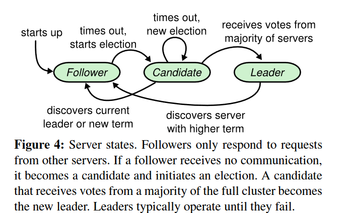

# MIT 6p824分布式系统项目
**为什么做**:
- 多年前就声名远播, 笔者认为现在稍微有空能做一下了.
- 熟练掌握一门副语言 (Golang. 主语言当然还是C/C++).
- 入门一个重要, 难, 经常耳闻但个人知识不成体系的领域.


**做了什么**
- lab#2: 从头到尾忠实地实现Raft算法. 需要充分考虑到单点宕机故障, RPC心跳包超时等实际问题.
- lab#3: 使用Raft算法构建集中式数据库.
- lab#4: 使用Raft算法构建分布式的**分片**数据库. 支持coordinator调整集群与数据片的映射关系.

**最终效果**
所有lab (多次) 稳定连续通过10000次 (笔者认为bug-free了, 可惜本课程不对外开放oj, 无法得知在官方的测试环境中的正确性与本实现的水准.).

Q: 为什么要用raft? raft有什么缺点嘛? 对数据一致性的要求就非得这么高嘛, 相对更简单的Redis主从结构甚至集群结构不行嘛?
> A: 根本原因是这个大lab有4部分, 其中lab#2要求忠实地实现raft共识算法 (悲). raft的确存在一些可能的缺陷:
- leader节点的负担太重了: 像zookeeper内部共识用的zab原子广播, 让leader节点负责写和同步, **众多的follower节点可以各自负责处理client的读请求**. 它随着集群的扩展是能提高吞吐量的. 但raft里对读请求依然需要leader广播, 达成majority日志持久化. 因此随着集群内部replica数目增加, **的确可靠性增加了, 但leader的RPC开销显著增加**, 吞吐量是减小的.
- **raft不像paxos支持"乱序commit"**. raft的log commit机制有一些性质, 基于下标 (index) 和日志对应任期 (term) 进行选举, follower日志的commit. 因此如果index为 $[i]$ 的日志条目没有被append, index为$[i+1]$的条目也无法被append, 更不能被commit. 这在网络质量比较差, 且`appendentry` RPC比较频繁且每个这样的RPC携带日志条目不多的情况下是可能发生的. 表现上非常像TCP的"Head-of-Line blocking"队头阻塞. TCP发生这种问题的根源是它字节确认且传输存在MTU; raft存在这种问题的根源是**协议要求的日志性质**.

Q: 实现raft算法遇到过什么坑吗?

> A: 选举阶段, 开始就有一个不好的设计. 我们考虑raft文章中的server状态机:

有一个现实的问题是, 当leader发送heart beat RPC但没得到足量的积极回应 (比如出现了partition, 且这个倒霉的leader在minority的一侧), **这个leader server应该怎么办**? 显然从上帝视角来看, 往后的一段时间不能继续是leader, 因此最开始的实现我选择让leader退化到follower (我们称呼为server#j), 代码大致如下:
```Golang
 rf.mu.Lock() 
 recognition_cnt := 1       // 自己的一票
 close(reply_success_chan) 
 for tmp := range reply_success_chan { 
 	if tmp { 
 		recognition_cnt++ 
 	} 
 } 
  
 if recognition_cnt*2 <= len(rf.peers) { 
 	// DPrintf("server %v step down to follower", rf.me) 
 	rf.state = Follower 
 	rf.persist() 
  
 	rf.mu.Unlock() 
 	return 
 } 
 rf.mu.Unlock() 
``` 
现在有什么问题? server#j倒计时结束后成为candidate, 开始term++, 广播RPC求票. 但是永远不可能成功: **因为它在minority的partition中**, 永远求不到足量的票, 也没成功当选的新leader去抑制它的RPC求票. 它一遍又一遍地倒计时到位后求票, 把term任期变量抬的很高, 下一次partition问题解决后, **成功选举出一个leader的term会变得非常大**, 出现**惊群现象**.
> 这个问题的根源还是没忠实地实现状态机: leader $\rightarrow$ follower的条件严格是遇到一个RPC交换时, term成员更大的server, **不应该在发现票不足数后, leader主动地退让**. 换句话说, **上帝视角下我们是允许整个集群同时存在多个leader的**, 但它们的term各不相同, 且仅term最大的那个合法, 这就够了.