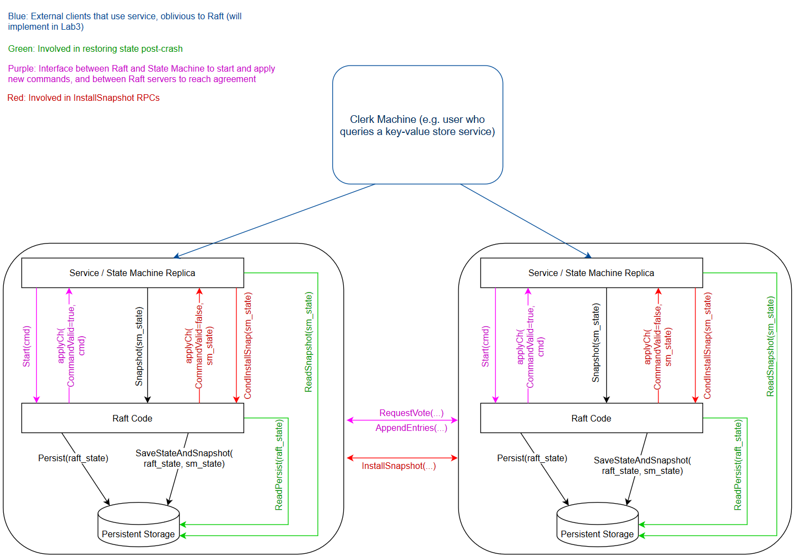
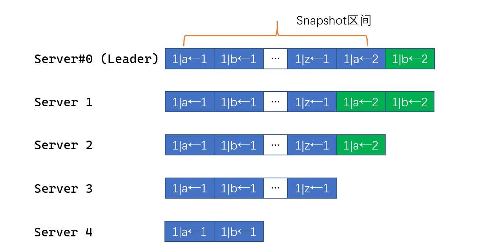

# MIT 6p824分布式系统项目
**为什么做**:
- 多年前就声名远播, 笔者认为现在稍微有空能做一下了.
- **熟练掌握一门副语言** (Golang. 主语言当然还是C/C++).
- 入门一个重要, 难, 经常耳闻但个人知识不成体系的领域.


**做了什么**
- lab#2: 从头到尾忠实地实现Raft算法. 需要充分考虑到单点宕机故障, RPC心跳包超时等实际问题.
- lab#3: 使用Raft算法构建集中式数据库.
- lab#4: 使用Raft算法构建分布式的**分片**数据库. 支持coordinator调整集群与数据片的映射关系.

**最终效果**
所有lab (多次) 稳定连续通过10000次 (笔者认为bug-free了, 可惜本课程不对外开放oj, 无法得知在官方的测试环境中的正确性与本实现的水准.).

Q: 为什么要用raft? raft有什么缺点嘛? 对数据一致性的要求就非得这么高嘛, 相对更简单的Redis主从结构甚至集群结构不行嘛?
> A: 根本原因是这个大lab有4部分, 其中lab#2要求忠实地实现raft共识算法 (悲). raft的确存在一些可能的缺陷:
- leader节点的负担太重了: 像zookeeper内部共识用的zab原子广播, 让leader节点负责写和同步, **众多的follower节点可以各自负责处理client的读请求**. 它随着集群的扩展是能提高吞吐量的. 但raft里对读请求依然需要leader广播, 达成majority日志持久化. 因此随着集群内部replica数目增加, **的确可靠性增加了, 但leader的RPC开销显著增加**, 吞吐量是减小的.
- **raft不像paxos支持"乱序commit"**. raft的log commit机制有一些性质, 基于下标 (index) 和日志对应任期 (term) 进行选举, follower日志的commit. 因此如果index为 $[i]$ 的日志条目没有被append, index为$[i+1]$的条目也无法被append, 更不能被commit. 这在网络质量比较差, 且`appendentry` RPC比较频繁, 每个这样的RPC携带日志条目不多的情况下是可能发生的. 表现上非常像TCP的"Head-of-Line blocking"队头阻塞. TCP发生这种问题的根源是它字节确认且传输存在MTU/MSS; raft存在这种问题的根源是**协议要求的日志性质** (成也萧何败也萧何?).

Q: 实现raft算法遇到过什么坑吗?

> A: 选举阶段, 开始就有一个不好的设计. 我们考虑raft文章中的server状态机:

有一个现实的问题是, 当leader发送heart beat RPC但没得到足量的积极回应 (比如出现了partition, 且这个倒霉的leader在minority的一侧), **这个leader server应该怎么办**? 显然从上帝视角来看, 往后的一段时间不能继续是leader, 因此最开始的实现我选择让leader退化到follower (我们称呼为server#j), 代码大致如下:
```Golang
 rf.mu.Lock() 
 recognition_cnt := 1       // 自己的一票
 close(reply_success_chan) 
 for tmp := range reply_success_chan { 
 	if tmp { 
 		recognition_cnt++ 
 	} 
 } 
  
 if recognition_cnt*2 <= len(rf.peers) { 
 	// DPrintf("server %v step down to follower", rf.me) 
 	rf.state = Follower 
 	rf.persist() 
  
 	rf.mu.Unlock() 
 	return 
 } 
 rf.mu.Unlock() 
``` 
现在有什么问题? server#j倒计时结束后成为candidate, 开始term++, 广播RPC求票. 但是永远不可能成功: **因为它在minority的partition中**, 永远求不到足量的票, 也没成功当选的新leader去抑制它的RPC求票. 它一遍又一遍地倒计时后求票, 把term任期变量抬的很高, 下一次partition问题解决后, **成功选举出一个leader的term会变得非常大**, 出现**惊群现象**.
> 这个问题的根源还是没忠实地实现状态机: leader $\rightarrow$ follower的条件严格是遇到一个RPC交换时, term成员更大的server, **不应该在发现票不足数后, leader主动地退让**. 换句话说, **上帝视角下我们是允许整个集群同时存在多个leader的**, 但它们的term各不相同, 且仅term最大的那个合法, 这就够了.

Q: 还遇到过哪些坑和状态机有关?
> A: 还遇到一个坑. 我们该怎么理解"discover server with higher term"这个条件? 它可能发生在任意时刻, 一个笔者最开始忽视的时刻为 **`leader`在广播append RPC中途可能退化为`follower`**.
```Golang
for peer_id := range rf.peers {
	// 考虑给自己以外的本集群内所有server发送RPC.
	if peer_id == rf.me {
		continue
	}
	wg.Add(1)
	go func(id int) {
		defer wg.Done()
		exit_loop := false
		// ...
		/*
		准备appendentry RPC的args.
		RPC丢包的话超时重传.
		*/
		for !exit_loop {
			reply := AppendEntriesReply{Success: false, Term: rf.current_term}
			call_chan := make(chan bool, 1)
			ok := false

			go func(idd int) {
				ok = rf.peers[idd].Call("Raft.AppendEntries", &args, &reply)
				if ok {
					call_chan <- true
					return
				}
			}(id)
			
			// 设定30ms的timeout, go-routine fire同时启动.
			ctx, cancel := context.WithTimeout(context.Background(), 30*time.Millisecond)
			select {
			case <-ctx.Done():
			// 倒计时打满分支
			case <-call_chan:
			// go-routine在倒计时之前写入了buffered channel
			}
			cancel()
			/*
			根据 ok变量和reply判断RPC通信成功与否, 请求是否如leader预期.
			一种特殊情况是RPC通信成功了, 但对端endpoint因为term更大明确拒绝.
			这个上下文是有互斥锁的, 但unlock的分支很多这里就省略了.
			*/
			if ok && !reply.Success {
				if rf.current_term < reply.Term {
					rf.current_term = reply.Term
					rf.state = Follower
					rf.persist()
					// 如果exit_loop不更新为true表明RPC没能在timeout内被响应, 因此继续走`for !exit_loop`循环.
					exit_loop = true
					reply_success_chan <- reply.Success
				}
			}
		} (peer_id)
	}
}
```
> 以上代码的问题在于: `rf.current_term = reply.Term`, `rf.state = Follower`, leader在接收到关于append entry RPC的明确拒绝时, **单单改变成员变量不调整控制流是错误的**. 一旦退化到follower后要立即停止append entry RPC的广播, 因此这个`if` 分支需要完整地退出`for peer_id := range rf.peers`整个循环! 如果不这么做, 对于`for peer_id := range rf.peers`中后启动的go-routine, 它们认为**实际上是过期的leader**, term非常新, 于是这些follower在一定情况下会删除自己的日志条目 (具体参见论文AppendEntries RPC impeachmentation的第3点.).

Q: 你上面这个`ok` bool变量有没有问题? 在go-routine A定义并多出使用, A又启动了一个新的go-routine B, B会修改`ok` (因为作为RPC通信成功与否的的返回值), 有没有数据竞争?

> A: 的确上面这个代码在解决**错误的状态机转换**问题后, 的确还存在数据竞争问题.
```
WARNING: DATA RACE
Write at 0x00c00016419f by goroutine 107:
  6.5840/raft.(*Raft).sendAppendEntries_broadcast.func1.1()
      /home/yhqian/archives/LABS/MIT_6p5840/src/raft/raft.go:569 +0x11c
  6.5840/raft.(*Raft).sendAppendEntries_broadcast.func1.3()
      /home/yhqian/archives/LABS/MIT_6p5840/src/raft/raft.go:576 +0x41

Previous read at 0x00c00016419f by goroutine 104:
  6.5840/raft.(*Raft).sendAppendEntries_broadcast.func1()
      /home/yhqian/archives/LABS/MIT_6p5840/src/raft/raft.go:592 +0xa52
  6.5840/raft.(*Raft).sendAppendEntries_broadcast.func2()
      /home/yhqian/archives/LABS/MIT_6p5840/src/raft/raft.go:634 +0x41
```
> 具体来说以下时间线的事情是完全可能发生的:
- go-routine A定义变量ok `ok := false`; 开启go-routine B, B可能赋ok为true.
- A启动了一个30ms的上下文持续阻塞在这里, 然后上下文到期了, A顺序执行.
- A因为上下文到期了判定丢包, 分支里做一些简单但不是原子的处理; **与此同时** (即进入了判定分支, 正在处理逻辑), go-routine B有了结果, 改了**ok**.
> 这里问题的核心是, 无法对RPC的时延做出一个很好的估计 (总会有离群值超出设定的上下文时长), 然后面对离群值时出现先读后写竞争.
解决方式很简单: go-routine A在启动go-routine B后不再直接使用`ok`变量. 和`ok`同时定义`tmp_ok`变量, **它只在严格的倒计时上下文被修改**. 后面的分支判断全用`tmo_ok`.
```Golang
ctx, cancel := context.WithTimeout(context.Background(), 30*time.Millisecond)
select {
case <-ctx.Done():
case <-call_chan:
	tmp_ok = true
}
cancel()
```

Q: raft实现中你遇到最大的困难是什么?
> A: 这个问题有一定的背景. 参见课程的蓝图[架构Api](http://nil.csail.mit.edu/6.5840/2023/notes/raft_diagram.pdf).

简单描述下这个非常隐蔽的问题 (**和go-routine的调度有关**): 当我们引入红色的快照系统后, 怎么处理新的`applyCh()`事件和旧的(关于append log)的`applyCh()`事件?
和实现有关: **如果这两个事件用同一个不会并发的函数实现, 通过不同传参触发那比较好弄**; 
但我的实现存在并发问题, 于是: **这里事实上存在一个同步关系, 需要我们自行保证**.

> 直到做到lab#4才找到这个问题. 考虑到给raft增加快照之后. 实质是raft需要按顺序地**commit**和**apply**, **commit**因为raft在算法上已经给我们保证了但是应用是对raft透明的, **怎么保证apply的顺序性**?
如果一个follower server (我们叫server#x) 很久之前崩溃了, 它现在启动且落后其他server很多了. 因为只有这一台机器崩溃了, 其他的servers依然构成majority能commit相当多的日志. 现在的问题是: 怎么让server#x快速赶上其余的server? 依然是基于appendentry, server#x自己commit, 最终逐个apply给应用层吗?
一个更好的方法是让server#x从leader处**直接安装快照**, 让它一次性在视图上与至少majority的server一致.
如下图, 在term#0, server#0持续为leader, 而server#4初期短暂在线后持续下线, 最终上线.

站在server#0的视角下, 蓝色的条目都被自己commit了所以能打包成快照, 维护快照的`Last_included_index/Last_included_term`, 即`[0...Last_included_index+1]`的完整slice之前作为log的slice, 现在整体作为snapshot.
server#0因为维护所有follower的nextIndex和matchIndex数组因此能注意到某些滞后的server (**比较数组中该server的项与Last_included_index即可**), 遇到这样的server, leader发送snapshot (目前的实现, 快照是全量的这是个不小的缺憾), 通过RPC.
- 之后的follower接受到快照后更新一些信息 (因为每个server都有快照, 只是leader能发送, 其他的只能被动接收) 后RPC返回. **有一些耗时的操作笔者用go-routine异步进行** (最主要的是apply到应用层)
- leader的snapshot RPC成功后, 更新对应follower的数组项 (不然**日志的追加** append entry RPC无法进行).
```Golang
func (rf *Raft) prepare_and_send_snapshot(server int) bool {
	rf.mu.Lock()
	// 忠实履行原论文. 唯独简化分块传输.
	args := InstallSnapshotArgs{
		Term:                rf.current_term,
		Leader_id:           rf.me,
		Last_included_index: rf.last_include_index,
		Last_included_term:  rf.last_include_term,
		Data:                rf.snapshot}
	reply := InstallSnapshotReply{}
	rf.mu.Unlock()

	ok := rf.sendInstallSnapshot(server, &args, &reply)
	if !ok {
		return false
	}

	rf.mu.Lock()
	defer rf.mu.Unlock()
	if reply.Term > rf.current_term {
		rf.state = Follower
		rf.vote_for = -1
		rf.current_term = reply.Term
		rf.persist()
		return false
	}
	if rf.current_term != args.Term {
		return false
	}
	/*
	快照对应的日志下标为[0, rf.last_include_index],
	因此下一个插入理论为rf.last_include_index+1.
	*/
	rf.next_index[server] = max(rf.next_index[server], rf.last_include_index+1)
	rf.match_index[server] = rf.next_index[server] - 1
	return true
}

func (rf *Raft) sendAppendEntries(server int, args *AppendEntriesArgs, reply *AppendEntriesReply) bool {
	ok := rf.peers[server].Call("Raft.AppendEntries", args, reply)
	return ok
}
```
- leader将snapshot以外的entry以append entry RPC发给这个server, 如上图的`1|b<-2`.
在leader的视角下, `prepare_and_send_snapshot`和`sendAppendEntries`两个RPC严格先后执行: 第一个结束了第二个才执行. **但是**follower响应RPC时, 都需要apply, 而apply是异步执行的.
```Golang
func (rf *Raft) InstallSnapshot(args *InstallSnapshotArgs, reply *InstallSnapshotReply) {
	rf.mu.Lock()
	defer rf.mu.Unlock()

	reply.Term = rf.current_term
	if rf.current_term > args.Term {
		return
	}
	if rf.current_term < args.Term {
		rf.state = Follower
		rf.current_term = args.Term
		rf.vote_for = -1
		rf.leader_id = -1
	}
	rf.reset_election_timer()
	if rf.commit_index > args.Last_included_index || rf.last_include_index >= args.Last_included_index {
		return
	}
	// 一些follower安装snapshot的逻辑.
	rf.log = []LogEntry{{Term: args.Last_included_term, Data: nil}}
	
	rf.last_include_index = args.Last_included_index
	rf.last_include_term = args.Last_included_term
	rf.commit_index = args.Last_included_index
	rf.snapshot = args.Data

	rf.last_applied = args.Last_included_index
	Messages := ApplyMsg{
		SnapshotValid: true,
		Snapshot:      args.Data,
		SnapshotIndex: args.Last_included_index,
		SnapshotTerm:  args.Last_included_term}
	// go-routine异步交付到应用层.
	rf.apply_lock.Lock()
	go func() {
		// rf.apply_lock.Lock()
		rf.applyCh <- Messages
		rf.apply_lock.Unlock()
	}()

	rf.persist()
}
```
- 早期实现版本中, `applyLogs`只会在特定时刻触发. **follower顺序响应prepare_and_send_snapshot和sendAppendEntries时**, 分别先后开启go-routine. **但是我们不能保证先开启的go-routine会先执行** (一切的问题都源于这个想当然的假定)!!!!
```Golang
// apply the committed logs.
func (rf *Raft) applyLogs() {
	rf.mu.Lock()
	defer rf.mu.Unlock()

	for i := rf.last_applied + 1; i <= rf.commit_index; i++ {
		rf.applyCh <- ApplyMsg{
			CommandValid: true,
			Command:      rf.log[i].Data,
			CommandIndex: i,
		}
		DPrintf("commit cmd by server %v. index/data: %v/%v", rf.me, i, rf.log[i].Data)
		rf.last_applied = i
	}
}
// example AppendEntries RPC handler.
//
// if `args.Entries` is empty, it is a heartbeat call.
// `index` starts from 1, and should subscripts `rf.log` with [0].
// follower apply的逻辑.
func (rf *Raft) AppendEntries(args *AppendEntriesArgs, reply *AppendEntriesReply) {
	/// ...
	// Receiver implementation (5)
	if args.Leader_commit > rf.commit_index {
		rf.commit_index = min(args.Leader_commit, len(rf.log))
		go rf.applyLogs()
	}
	/// ...
}
// leader apply的逻辑.
func (rf *Raft) sendAppendEntries() {
	for log_index := rf.get_nxt_log_index() - 1; log_index > rf.commit_index; log_index-- {
		cnt := 1
		if rf.log[log_index].Term == rf.current_term {
			for peer_id := range rf.peers {
				if peer_id != rf.me && rf.match_index[peer_id] >= log_index {
					cnt++
				}
			}
			if 2*cnt > len(rf.peers) {
				rf.commit_index = log_index
				DPrintf("server %v as leader, updates commit index to %v", rf.me, rf.commit_index)
				go rf.applyLogs()
				break
			}
		}
	}
}
```

我们再看这个图. b的最新值是`2`. 因此对于后开始的, 对应append `1|b<-2`这个log entry的go-routine我们严格要求它后执行: 如果先执行它, 再执行对应的snapshot的话, `b:2`会被snapshot覆盖 (**这个问题是疯狂打印高精度日志才发现的**)!

如何解决这个问题? 这里笔者注意到一点: **如果出现这种"snapshot"和"append log"并发的情况, 我们严格地需要"snapshot"先响应完成再响应"append log"**. 分析出后笔者使用**条件变量+专用互斥锁**解决这个问题 (因为也只需要同步这两个, 不需要考虑扩展性).
使用`rf.apply_lock`这把专门的互斥锁处理apply. 这样只需要保证`InstallSnapshot()`内的go-routine率先获得这个锁就行了. `InstallSnapshot()`进入就获取全局锁, 修改`rf.last_applied`, `rf.commit_index`, 同时`applyLogs()`因为条件变量wait. 等到被唤醒时 (这就保证了后发生), 会等待`rf.apply_lock`专门锁的释放.
```Golang
// apply the committed logs. only use a single go-routine.
// protect with mutex when `append` into buffer. when the `append` into buffer operation
// is ended, release the lock so it can do other operations (response to other RPCs.)
func (rf *Raft) applyLogs() {
	rf.mu.Lock()
	defer rf.mu.Unlock()
	for !rf.killed() {
		Messages := make([]ApplyMsg, 0)
		// 在接收leader的snapshot后 (启动它的go-routine前), rf.last_applied, rf.commit_index会更新到一样大. 于是cv进入wait.
		if rf.last_applied < rf.commit_index {
			for i := rf.last_applied + 1; i <= rf.commit_index && i <= rf.last_log_index(); i++ {
				Messages = append(Messages, ApplyMsg{
					CommandValid: true,
					Command:      rf.log[i-rf.last_include_index].Data,
					CommandIndex: i,

					SnapshotValid: false,
				})
				rf.last_applied = i
			}
			rf.mu.Unlock()

			rf.apply_lock.Lock()
			for _, msg := range Messages {
				rf.applyCh <- msg
			}
			rf.apply_lock.Unlock()

			rf.mu.Lock()
		} else {
			rf.apply_cond.Wait()
		}
	}
}

// example AppendEntries RPC handler.
//
// if `args.Entries` is empty, it is a heartbeat call.
// `index` starts from 1, and should subscripts `rf.log` with [0].
func (rf *Raft) AppendEntries(args *AppendEntriesArgs, reply *AppendEntriesReply) {
	/// ...一系列复杂逻辑, 包括对log的追加, 最后unlock.
	if args.Leader_commit > cur_commit_index {
		rf.mu.Lock()
		rf.commit_index = min(args.Leader_commit, last_log_index_2)
		if rf.last_applied < rf.commit_index {
			rf.apply_cond.Signal()
		}
		rf.mu.Unlock()
		// go rf.applyLogs()
	}

	reply.Success = true
}
```

> 在日志debug后, 笔者更进一步地查看了golang的文档 (主要和[内存模型有关](https://go.dev/ref/mem), 同时也深化了C++11关于memory order的一些知识), 与这个bug直接有关的内容如下 (均摘录于上面的链接):

>  The go statement that starts a new goroutine is synchronized before the start of the goroutine's execution.

> The exit of a goroutine is not guaranteed to be synchronized before any event in the program. For example, in this program:

> If the effects of a goroutine must be observed by another goroutine, use a synchronization mechanism such as a lock or channel communication to establish a relative ordering.  