# 电网项目
**为什么做**:
- (因为部分涉密且签署保密协议, **以下笔者仅能透露脱敏信息**)
- (因为整体这是老板的项目, 但他给不出建设性建议)
- 上层任务需要符合实际**拓扑性质**与**地理性质**的**美国电网** (需要地理性质因为要与其他非电网模块**联调**).
- 实际的电网信息高度敏感且往往仅关心**拓扑性质**. 无法获取真实的电网数据 (更别论是美国的), 学术界仅开源**极少数基于算法合成的电网** (算法实现闭源), 同样只考虑拓扑.


**做了什么**
- 基于**脱敏公开的地理信息**构建合成电网的**元数据**.
- 实现算法, 让我们**合成**的电网在拓扑性质上, 符合实际电网统计出的一系列**图论性质** (即电网作为图论意义上的图, 应当符合的一系列性质).
- **合成**的电网哪怕符合一系列**拓扑性质**也未必可行, 因为它还需要满足一系列**电气性质**.「不可行」简单定义为执行某种预期会收敛的计算最终失败, 而这种「计算」往往依赖特定的执行环境 (具体的, Matlab). 我们让client在docker容器中执行**验证**工作.
- server的**合成**相当缓慢 (与client的**验证**相比). 为缓解此问题, 我们进入消息队列, 允许多个servers同时**合成**, 基于地理区域创造分区 (partition).
- client与server之间开始连接需要认证. 对于进行过「验证」的电网, client向server返回报文, server侧进行bookkeeping (这个电网能不能用? 不可行的可以直接删了)
- 天气对电网 (故障发生的概率) 有重要影响 (主要是气温, 风力), 且一张电网只表示其在特定天气切面下的状态. 我们从IEEE的现行标准出发, 实现了对同一张电网, 从当前的<气温, 风力>迁移到目的<气温, 风力>的**仿射变换**.


**最终效果**
每日为上游任务提供约 $1000$ 张高质量的小规模电网 (节点数 $n \leq 1000$).

Q: 这个项目的架构如何?
架构如图所示.
- server侧和client侧都由简单的命令行循环驱动. 命令行的重要功能包括server侧生成数据, client侧批处理验证数据, 汇报结果.
- 从server数量扩展性角度考虑, server生成的数据写入kafka中, server启动时会将预先生成的 (即没走命令行的) 数据先写入kafka.
- server会在mysql记录电网的消息摘要码和文件路径.
- client对电网数据的验证因为业务复杂性, 在docker容器中进行.
- **项目绝大部分的复杂度在于server侧的数据生成.**
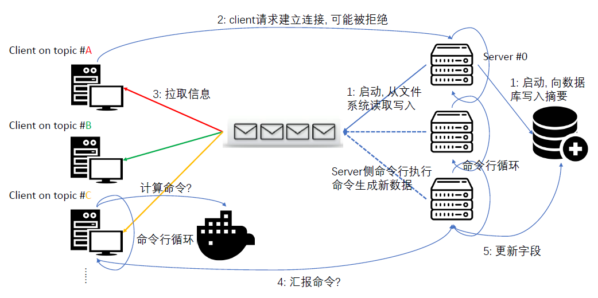

Q: 电网需要「拓扑信息」是比较显然的, 为什么还需要「地理信息」? 不带地理信息的电网是什么样的?

>A: 我们先别考虑电网, 用一个计算机网络的例子来解释**拓扑信息**与**地理信息**的区别. 如图 (见[链接](https://ethw.org/Milestones:Inception_of_the_ARPANET,_1969)) 是1969年最初的ARPA NET. 从拓扑角度我们能认为是一个$K_{3}$完全图加一个悬挂边. 但边的长度是否有意义? **更长的边意味着更大的路由延迟更大的丢包概率, 以及更大的线路故障概率 (假设我们认为存在一个线密度)**. 组网在拓扑信息相同, 但地理信息不同的情况下, 效果是不尽相同的.
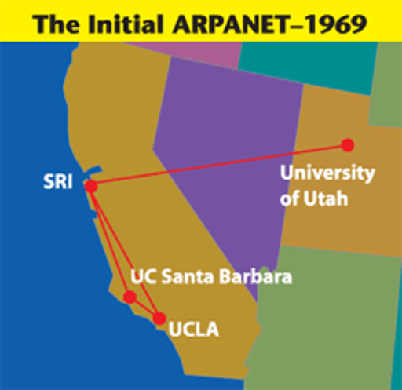 
学术界能用的典型电网 (不带地理信息的) 是这样的 (ieee 9 bus测试案例), 在节点与传输线构成的无向图之外, 还附带一系列电气参数:
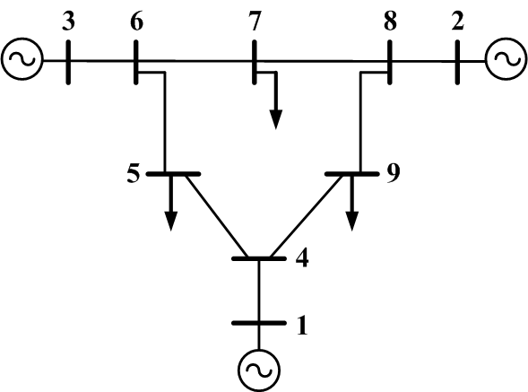
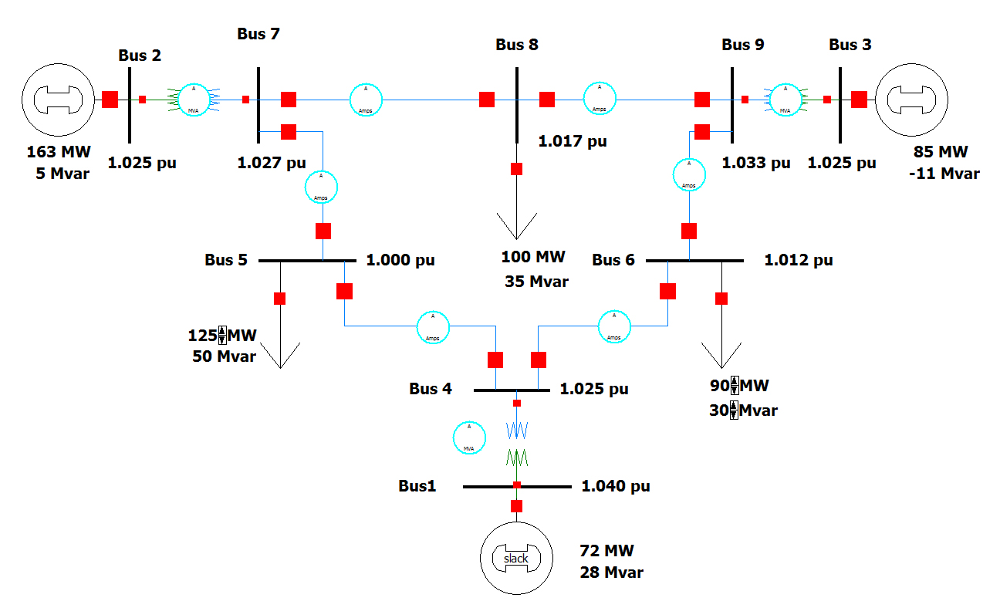
再比如少数像ieee 39 bus测试案例这样的, 描述了**对应的地理位置区域** (新英格兰地区), 但只有非常少的测试样例像这样给出了每个节点的**地理位置**, 而且ieee的测试样例绝大多数规模小 (节点数 $n<200$) 且无关地理信息.
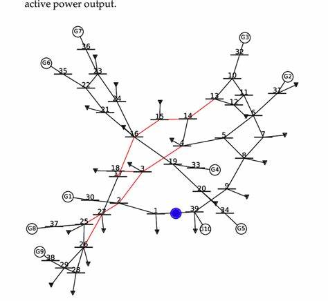
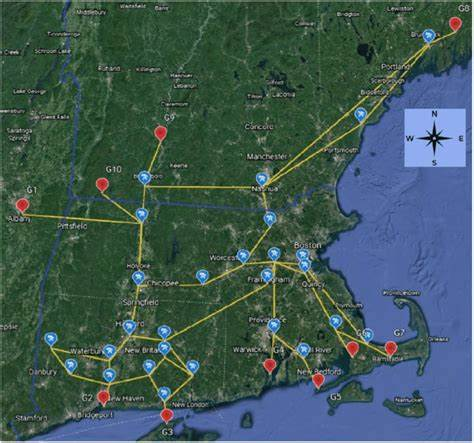

除了ieee测试案例外, 存在合成电网的工作, 这部分工作仅开源少量数据而未开源算法 (**像这样用地图描述的仅存在于demo, 实际数据无法获得**), 而公开的数据**难以对拓扑结构进行改造调整** (少量的改动就会对电力的调动造成重大的影响, 稍微可行的是调整电气参数)
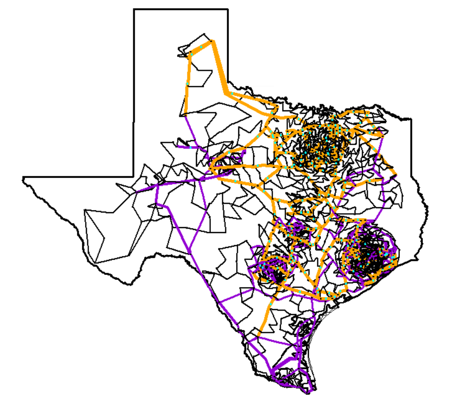

Q: OK, pipeline中元数据有哪些?
> A: 最重要的元数据是[美国人口普查](./uszips.csv) (本项目使用2014版, 一个[在线链接](https://beta.sedac.ciesin.columbia.edu/data/set/gpw-v4-population-count)), 普查以zip邮政编码为主键逐行维护一些信息. 最重要的信息包括**zip码, 经纬度, 人口数, 所属州**. 人口数直接关连节点的用电量; 所属州给出了合成电网的物理边界.
如下午笔者将南卡罗莱纳州的所有zip点画在地图上:
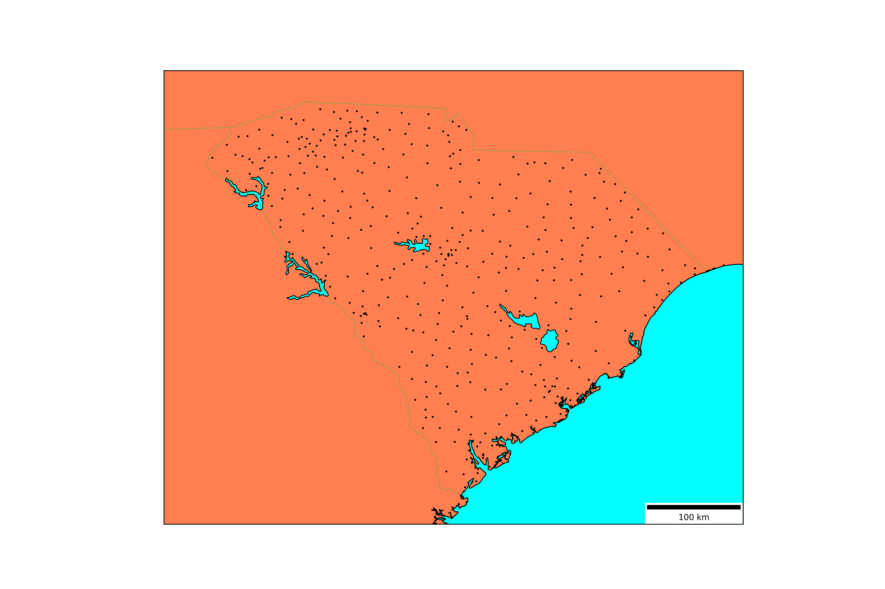
我们的方案就是从这些原始点出发, 通过参数控制聚类可以合成**规模不同, 但描述的地理区域相同**的类似的电网.

> 除此以外, 所有装机量 (可以理解为全力开动时的最大功率)$\geq 1MW$的发电站都能获得. 一个[在线](https://atlas.eia.gov/datasets/eia::power-plants/explore)网站可以可视化地获得对应数据, 如下图, 同时数据可下载为`.csv`文件.
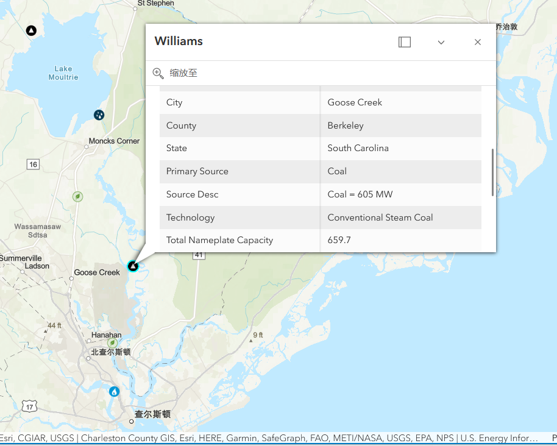
我们将所有电厂的位置也显示在同一片地图上. **zips+电厂**构成了所有的(与地理人口相关的)元数据 (蓝色的点是电厂).
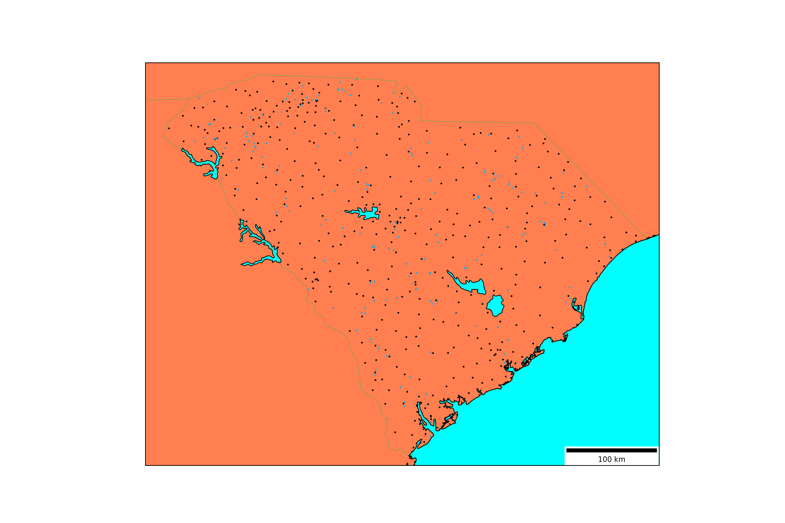

Q: 这个点有点多啊. 你有什么处理的pipeline吗?
> A: 为了实现同一片地理区域, 不同"分辨率"的效果, pipeline中比较早的阶段进行了对点的**聚类**. 另一方面为了限制不同点的距离不至于太近.对于zip点, 我们用**人口数**表征点的权重. 假设原始的两个zip点$A, B$, 各自的经纬度为$Lon, Lat$, 人口为$Popu$, 则合成后的点的经纬度为:
$$\frac{Popu_{a}}{Popu_{a}+Popu_{b}}.\begin{bmatrix}Lon_{a} \\Lat_{a}\end{bmatrix}+\frac{Popu_{b}}{Popu_{a}+Popu_{b}}.\begin{bmatrix}Lon_{b} \\Lat_{b}\end{bmatrix}$$
需要注意的是, 对合成出来的**等价zip点**, 它们非常可能参与新的合成. 因此实际流程中, 每个合成出的等价zip点都会维护完整的**初始zip点集合** (这是一个并查集的例子.). 假设我们要合成两个等价zip点 $X,Y$各自对应了初始点集 $\{\alpha_{1}\cdots\alpha_{n}\}, \{\beta_{1}\cdots\beta_{m}\}$, 现在的合成使用 $n+m$个初始zip点 (它们是不交的), 各自权重形如 $\frac{\alpha_{t}}{\sum_{i=0}^{n}\alpha_{i}+\sum_{i=0}^{m}\beta_{i}}$.

> **开发过程中还实际发现了一个bug**: 如果$Popu_{a}$和$Popu_{b}$都为0了怎么办? 在处理德州这样比较"地广人稀"的区域发现了这个情况: 这会在距离zip点A最近的邻居是zip点B, **两者人口都是0而算法现在打算聚合它们时**触发这个边界情况 (golang不会panic, 但会认为计算出的是NAN让后续计算出错.). 应对这种情况, 笔者让每个zip**至少拥有1人口**.
算法的聚合会计算计算任意结点对之间的**距离**, 事实上因为元数据是只读的, 我们预先计算了每个点在领域 $\epsilon < 100km$ 以内的邻居集合存储在数据库 (同样是只读逻辑), 因此我们载入所有这样的**邻居对**, 使用优先级队列维护聚合的过程.
具体来说我们在golang需要实现一系列接口 (针对自定义数据类型)
```Golang
type origin_zip struct {
	Coord    haversine.Coord
	Popu     float64 // ????
	Zip_code uint
}

type clustered_zip struct {
	Origin_zips []origin_zip
	Eq_lat      float64
	Eq_lng      float64
	Total_popu  float64
}

type clustered_pair struct {
	cluster_A *clustered_zip
	cluster_B *clustered_zip
}

type clustered_pair_heap []clustered_pair

func (h clustered_pair_heap) Len() int {
	return len(h)
}

func (h clustered_pair_heap) Swap(i, j int) {
	h[i], h[j] = h[j], h[i]
}

func (h *clustered_pair_heap) Push(x interface{}) {
	*h = append(*h, x.(clustered_pair))
}

func (h *clustered_pair_heap) Pop() interface{} {
	old := *h
	n := len(old)
	item := old[n-1]
	*h = old[0 : n-1]
	return item
}
// 以及Less接口.
func (h clustered_pair_heap) Less(i, j int) bool {
    // 计算元素i和元素j的"特征值".
    // i成员是个pair: `cluster_A`, `cluster_B`, 假设分别有n和m个初始元素
    // 计算加权平均距离 (权就是上面的人口). 距离更短的Less在前.
}
```
笔者使用一个参数控制聚合后点数控制结束.

> 上面描述的是对zip点的聚合, 对电厂节点的聚合类似, 但略有不同. 首先对电厂而言使用**装机量**作为权重. 其次考虑到不同能源性质的电厂在架构上相当不同, 且电厂元数据有字段`PrimSource`表征主能源性质 (如`petroleum`, `natural gas`, `hydroelectric`, `nuclear`). 笔者这里特判限制, 对于特定能源 (典型如`nuclear`, `hydroelectric`) 聚合的两端所有电厂只有**能源性质一致**, 才能聚合.

Q: 聚类中**权重**是一个要素, **距离**的度量方法也很重要. 这里距离是怎么量度的, 它反复出现?
> A: 给定地球上两个点的经纬度, 我们使用常规的haversine距离度量, 参见[wiki主页](https://en.wikipedia.org/wiki/Haversine_formula). 在不考虑**海拔差异, 地球作为球体的不规则性等更现实情况时**, 此公式衡量两点的测地线距离是完美的. 本项目量度大量使用该距离.
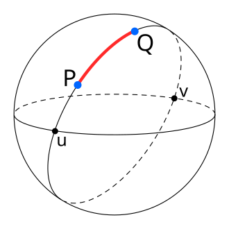

Q: OK, 对于节点还有什么约束吗?
> A: 上面提到了zip合成用电节点 (即PQ节点), 电厂节点合成供电节点 (即PV节点). 但现实中它们不是一个二分类问题, 即在所有有用电需求的节点中, 存在一定数目 (一般为 $5\sim10\%$) 的节点同时自身会**供电**, 虽然它们**未必自给自足**, 可能依然需要外界一定程度地输电, 或者本节点有余力向外输送部分.
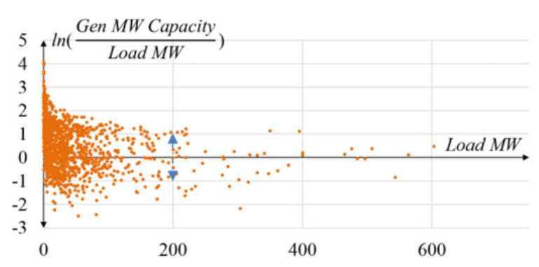
为此, 我们从全体聚合后的PQ节点中, **随机抽样**部分节点作为**能自身供电的节点**. 同时同现有文献出发 (如上图所示), "自给自足"的比率一般在 $(\frac{1}{e}, e)$ 之间, 我们在这个区间生成均匀分布的随机数$x$, 含义为假设PQ节点$A$需要 $M W$的有功功率, 那么本地能发电 $Mx W$ 的功率. 我们按照剩余PV节点离$A$的距离从近到远候选, 依次聚合到节点 $A$, 被聚合的PV节点被移除.

Q: ok, 现在能描述下**电网作为图论意义上的图, 它有哪些特殊之处吗**? 生成的时候有什么考虑?

> A: 电网作为图的性质, 非常大的程度上决定了我们下面 "连边" (传输线) 的过程. 具体来说作为图的性质有下列:
- **稀疏性**: 一般意义上, 我们认为一个图边的数目 $m$ 不超过 $nlogn$ 即为**稀疏图**, 其中$n$为图节点的数目. 而现实数据分析电网中$m\approx1.2\sim1.3n$.
- **节点度数的指数分布**: 现有的文章有分析, 与社交媒体网络等度数趋向于幂律分布不同, 电网因为相比之下缺少无可争议的中心节点导致不会出现度数很大的节点 (e.g., 度数$>10$), 且在度数 $>3$后呈现指数分布, 而度数为1的叶子节点和度数为为2的节点需要单独考虑校验. 这部分信息笔者follow[文章](https://ieeexplore.ieee.org/document/7515182).
- **传输线总长较短**: 很好理解, 因为传输线路的长度和建设成本直接挂钩. 如果从最小生成树出发, 全局成本得以最小化, 但是:
- **较短的随机跳数**: 电网因为线路的假设是逐步进行的, 很难在一开始就以最小生成树来规划. **而且**仅仅是最小生成树的话电网一点也不够健壮, 因为任意两点之间的条数太长了且固定, 这将导致**无功功率**难以长距离输送: 传输线发热量少, 有功功率的损耗一般远小于 $5\%$, 但对无功功率的消耗就大很多 (无功功率可以理解为"泵"). 电网图的"平均跳数"约为$\sqrt{n}$, 在规划总长度较短时需要考虑平均跳数.
- **较小的团系数**: 在联通图的基础上, 我们添加一些冗余的边. 电网倾向于让这些冗余的边别构成一个完全图, 即直观上来说电网不喜欢边"抱团".
考虑一个完全图, 它的团系数为1. 设电网有一个点$A$, 它的全体邻居为 $B, C, D, E4$ 个点. $4$个点最差构成完全图共$6$条边, 但实际这$4$个点两两连出 $x\in\{0, 1, 2, 3, 4, 5, 6\}$个边, 于是点$A$对应的团系数为$\frac{x}{6}$. 我们计算整个电网的平均团系数 (所有点权重相同) $\beta$, 一般地它会很小 ($< 0.1$).
- **平面图倾向**: 如下图所示的是**平面图**: 将一些边拉伸后, 边与边只在节点有交.
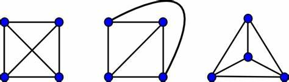
但与此同时, 有相当数量的图在不改变拓扑的情况下无论怎么对边拉伸, 它依然不可能是平面图, 比如下图的Peterson图.
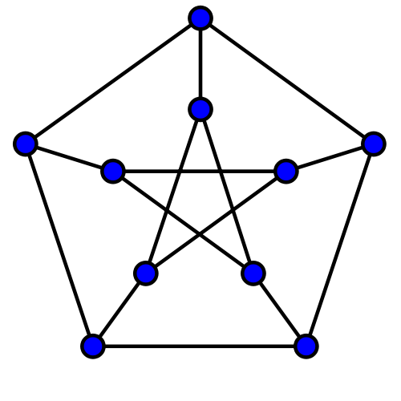
电网中只有较少的边与其他边在非节点 (PV, PQ节点) 处相交. 但同时, 电网的传输线一般都是直的 (比如沿着长距离公路排布), 以节省建设成本.

Q: 这么一大坨性质, 你打算怎么着手开始连边?
> A: 之前有一些研究考虑了delaunay三角剖分, 它是一种特殊的三角剖分, 与最小生成树有着有趣的关系. 像下图(a)就不是delaunay三角剖分, 因为存在点$d$, 在$a, b, c$三点构成的外接圆内. **delaunay三角剖分**要求剖分出的任意三角形, 其外接圆内无其他点, 除了弧上的此三点. 可以证明给定点集, delaunay三角剖分**必定存在** (但不一定唯一, 对同样的图我用不同的三方库就剖出来不一样). delaunay三角剖分的一个性质为: **给定同样的完全图, 最小生成树的边集, 是delaunay三角剖分边集的子集**! 更多信息见[slide, 有对应关于MST的条目](https://www.cs.umd.edu/class/fall2021/cmsc754/Lects/lect11-delaun-prop.pdf).
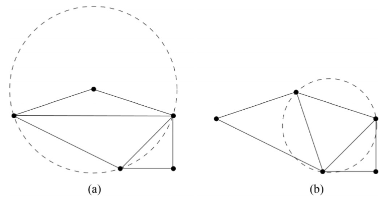

> 三角剖分后的边集部分如下, 其中红实线为MST边集, 黑虚线为delaunay三角剖分边集 (剔除MST边集), 黄虚线为delaunay三角剖分"一阶邻近边集" (这个中文是笔者杜撰的, 可以理解为delaunay三角剖分生成了一个表示联通性的0/1矩阵$M$, 如果$M[i][j]=0但M^{2}[i][j]=1$, 则$<i, j>$是一阶临近关系.)
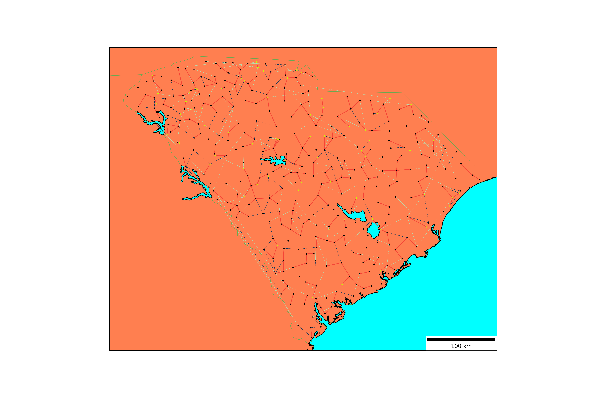
我们从三角剖分边集中选边, 有一个好处: 原本完全图的$n*(n/2)$边数空间, 现在下降到$3*n$, 即初始的delaunay三角剖分给出 $3*n$ 的边数目, 而通常电网的$n\in[100, 10000]$. 考虑到拓展为三阶临近关系, 边数也不会超过 $27*n$.
**因此笔者的算法宏观来说, 设定总的边数 ($1.21n$), 给定每一类边配额 (MST边, 一/二/三阶临近边), 不断地擦除, 添加, 直到收敛到上述条件**.

Q: 你是怎么具体地"擦除"边, "添加"边的?
> A: 首先我们用prim算法 (优先级队列优化)生成完全图的最小生成树, 同时delaunay三角剖分得出一/二/三阶临近关系的边集.
每轮迭代我们首先 (单线程) 统计下列信息:
- 每个节点的度数
- 并查集计算当前联通分量数, 每个联通分量内的点集.
- **与其他边在非节点处相交**, 这样的边的数目 (比例). 依然是边数的二重循环, **判断是否交**是一个线性代数问题.

> 有大量的边目前没选中. 我们考虑哪些边的加入, 会让本轮更趋近最终收敛状态. 考虑的要素包括:
- 沟通不同的联通分量, 这样的边是"好边".
- 更短的边, 这样的边是"好边".
- 边的加入如果让两端任意一点度数上升**导致该类度数的点占比超过阈值**, 这样的边是"坏边".
> 对每个边进行这样的打分 (对应项为"好"给一个负的penalty, 对应项为"坏"给一个正的penalty, 最终按penalty**从小到大排序**.). 每一个边最终的打分笔者使用了一个$(0.95, 1.05)$的均匀分布随机数scale了一下 (实测这样收敛更稳定些).

> 由于笔者的算法中每类边都有一个配额, 需要决定每类边中哪些边被剔除, 对应类的边打分优先的换入. 在计算哪些边需要被换出时, 每个边对应的点还需要计算"团系数", 以抑制边过度聚集的情况, 它依然作为penalty的一项. 上述打分的过程可以开不同的go-routine完成, 这里笔者固定为$10$个, 使用wait group简单控制.
> 最终收敛生成的符合拓扑要求的电网拓扑图示例如下: 实际结果表明, 对于节点在 $n<500$时, 迭代基本上能在$50$轮内收敛, 耗时$10s$以内; 对于节点数接近$n\approx1000$的情况, 比较好的情况在$300$轮内收敛, 耗时近$30s$且没有很强的保证.
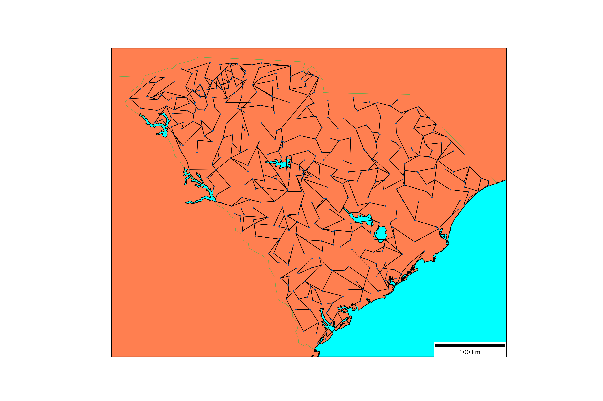

Q: 拓扑性质只是电网的一类性质. 其他的图也有拓扑, 电网独有的一些电气性质你怎么考虑的?
> A: 首先上文提到了PQ节点的人口, PV节点的装机量. 笔者follow之前的文章, **每个人口对应2KW+0.57KVAR的有功/无功功率需求**. 如果要改变功率因子的话, 对应改变无功功率值. 同时装机量一般来说是大于人口需求的 (但是电厂几乎不可能在短时间内将功率爬高到装机量, 于是我们将每个发电厂的最大发电量, scale到总用电需求的$1.3$倍, 装机量是总用电需求的$2$倍以上).
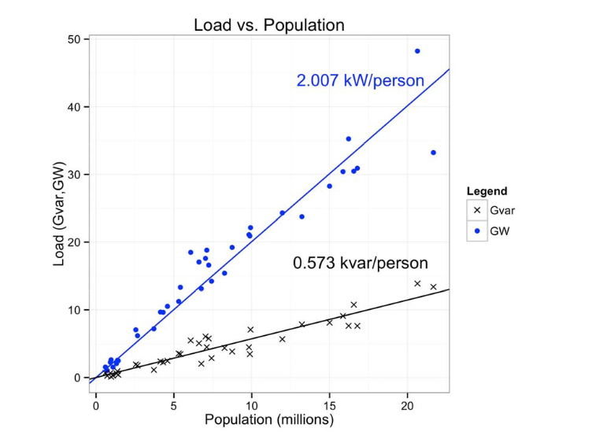
除用电需求外, 节点的重要电气属性包括运行时的电压相量 (phaser), 一般地用 **电压幅度 (`Vm`) 和较参考节点的相位 (`Va`, 角度制)** 描述, 其中`Vm`通常采用标幺值. 如节点的标准电压为$138KV$, 标幺值会记为$1$, 电压上界$1.1$则代表$1.1*138KV$. 节点会有运行时的允许电压的上下界 (**同样标幺值表示**), 其他次要的电气参数暂时不表 (因为计算模型中存在但可以忽略).

> 联通节点的传输线, 存在其他的电气参数: 主要是串联的电阻电抗 (`r`, `x`. 它们可以看成复数的实部和虚部). 这方面简要的内容可以查看[slide, 37页的上下文](./slices/Section%204%20Transmission%20Lines.pdf).
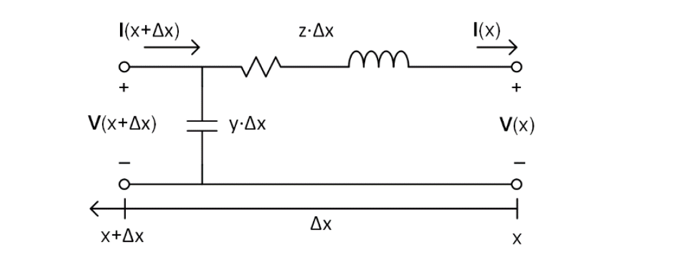
即需要计算上图描述的的`z`, 涉及求解常微分方程. **这里的事实是: 长度为`1km`的传输线如果复阻抗为$x$, 那同配置长度为`2km`的传输线不是`2x`, 变化是非线性的** (这是电学模型里集中式lumped-model和分布式distributed-model的区别). 当传输线长度比较长时, 误差是无法忽略的. 而这里的计算参数和**配置**紧密相关.

Q: OK那能介绍下配置吗?
> A: 配置是根据传输线规格, 输电塔形制来的.
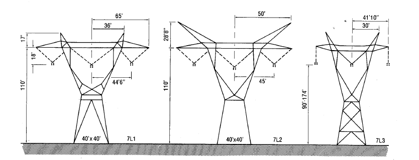
如上图显示的是$750KV$电压规格下常见的输电塔规制. 重要的信息包括:
- 三相电, 相与相之间的距离 (如最右侧的$30$英尺)
- 相与地的距离 (如最右侧图的$90$英尺)
> 我们首先给出了两侧节点的电压等级 (即上述标幺值标度下的$1$, 笔者的系统一般都是$375KV$), 然后从所有满足的输电塔配置中随机选择1个. 输电塔的这两个距离会影响相与相之前的电容, 电感; 输电塔两侧产生的电容.

> 另一个配置是, 单相位一般对传输线采用**集束配置**以提高运力降低电阻, 您如果仔细看上图的话, 应该能看到每一相都有**4个点**, 一般地塔的电压规格越高, 倾向于使用更大的集束. 这方面简要的内容可以查看[slide, 11页的上下文](./slices/Section%204%20Transmission%20Lines.pdf).
配置的最后一部分是传输线. 我们考虑ACSR (Aluminum Cable Steel Reinforced Conductors) 型传输线, 即钢结构保证机械强度, 铝结构保证导电性. 通过一些厂商给出的handbook可以知道详细的基本参数, 举例如下.
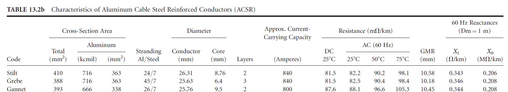
使用这些原始数据, 结合**集束配置**, **输电塔配置**, **传输线总长**, 我们可以得到边的所有电气参数. 电气参数除了线路的**阻抗导纳**外, 还有**功率的承载能力** (如上图直接用电流强度衡量, 但实际中用的更多的是视在功率).

Q: OK, 这部分电气参数有哪些具体计算的公式?
> A: 以下公式省略复杂的推导过程 (其实很多能从textbook上获得, 计算相对简单).
- 给定ACSR的元数据, 线总长, 交流电频率 (如我国为$50Hz$, 美国为$60Hz$), 塔楼的配置.
```Golang
// compute inductance effect of `t` tower configuration. return value in H per meter.
// See P184, 192, 194 (especially the context of equation of (4.6.22)) of power system analysis and design.
func (t *TowerConfig) ComputeInductance(tl *TransmissionLine) float64 {
	// we consider 3 phases locate linearly and uniformly.
	var GMD float64 = math.Pow(2*math.Pow(t.PhaseSpacing, 3), 1.0/3)
	var DSL float64 = math.Pow(tl.GMR*math.Pow(BundleSpacing, float64(t.BundleCnt)), 1.0/(float64(t.BundleCnt+1)))

	return 2 * 1e-7 * math.Log(GMD/DSL)
}
```
$$D_{eq}=\sqrt[3]{D_{12}D_{23}D_{13}}$$
$$D_{SL}=\sqrt[3]{D_{s}\times d^{2}}$$
$$L_{a}=2\times10^{-7}\ln{\frac{D_{eq}}{D_{SL}}} \text{H/m}$$
> ($D_{SL}$对三集束而言) 其中$D_{s}$是ACSR的**等效半径** (近似为物理半径的$e^{-1/4}\approx0.78$倍, 这又是个复杂的电磁学计算), 由handbook给出. $d$是集束配置中中心点间距, 如下图.
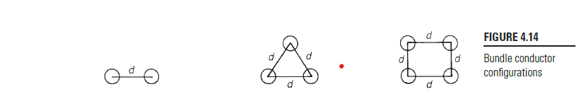
$D_{SL}$是相与相之间距离的几何平均, 如下图 (**所以说输电塔的配置需要某个距离**). 这里$L_{a}$就是计算出单位串联电感. 结合长度和角频率最后得出`x`参数.
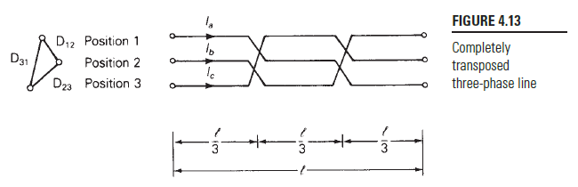

```Golang
// compute capacitance effect of `t` tower configuration. return value in F per meter.
// See P208 (especially the context of equation of (4.10.4)) of power system analysis and design.
func (t *TowerConfig) ComputeCapacitance(tl *TransmissionLine) float64 {
	var GMD float64 = math.Pow(2*math.Pow(t.PhaseSpacing, 3), 1.0/3)
	var DSC float64 = math.Pow(tl.Diameter/2*math.Pow(BundleSpacing, float64(t.BundleCnt)), 1.0/(float64(t.BundleCnt+1)))

	return (2 * math.Pi * FreeSpacePermit) / math.Log(GMD/DSC)
}

// Resistance of serial impedance.
// See P260 (the context of Π circuit) of power system analysis and design.
// please notice that circuit only applies to short and medium length line.
// for long transmission line, we have to solve differential function. Also see slice Section 4, P15~25, 36~51, 72~73.
// dist in km. return in Ω.
func (t *TowerConfig) ComputeTotalR(tl *TransmissionLine, dist float64) float64 {
	return (tl.ResistanceDC * dist) / 1000
}

// Inductive Reactance of serial impedance. dist in km, freq in Hz.
func (t *TowerConfig) ComputeTotalX(tl *TransmissionLine, dist float64, freq float64) float64 {
	return 2 * math.Pi * freq * dist * 1000 * t.ComputeInductance(tl)
}

// Capacitive Reactance of shunt . dist in km, freq in Hz.
// return in S.
func (t *TowerConfig) ComputeTotalB(tl *TransmissionLine, dist float64, freq float64) float64 {
	return 2 * math.Pi * freq * dist * 1000 * t.ComputeCapacitance(tl)
}
```
> 另一方面, 传输线整体和大地 (大地被认为是电中性neutral的) 构成一个电容器. 这部分计算:
$$
C_{an}=\frac{2\pi\epsilon}{\ln{\left(D_{eq}/D_{SC}\right)}} \text{F/m}
$$
这里$\epsilon$是真空介电常数, 其余参数以上描述过且能用相同的方法计算得出.
以上我们能得出传输线的串联阻抗和并联导纳, **当传输线路的长度可以忽略时这就足够了**. 但长度不能忽略时 (主要是交流电有**频率**, 就会有**相位**. 从一段传播到另一端是存在相位差的, **相位差和传输线长直接相关**). 我们根据已有的参数计算传播因子([wiki页面](https://en.wikipedia.org/wiki/Propagation_constant)), 这方面简要的内容可以查看[slide, 46页的上下文](./slices/Section%204%20Transmission%20Lines.pdf).
$$Z'=Z\left(\frac{\sinh\left(\gamma l\right)}{\gamma l}\right)$$
即串联阻抗$Z$需要一个关于距离的**非线性修正**, 其他参数同理.


Q: OK. 以上这么多可以说是**生成**的步骤, 确实很麻烦. 那么**验证**又是什么? 又为什么要验证?

> A: 因为哪怕我们生成的电网拓扑上很合适, 电气参数上也很合适, **它也不一定可行**. 我们衡量"可不可行", 是指每个要求被供电的节点, 它的需求能不能被满足, 同时每个节点的状态是不是稳定的 (简单来说电压的幅度要在一个比较窄的区间内, 才算稳定; 线路两端的相位差要足够小才算稳定.). 一种稳态的计算任务就是所谓的**潮流分析** ([参见wiki页面](https://en.wikipedia.org/wiki/Power-flow_study)). 潮流分析非常复杂, 一般使用基于迭代算法的开源软件求解 (因为实际上这个是高度非线性的优化问题). 我们生成的电网**未必能求解潮流分析**, 因此我们需要这个**验证**的步骤.
现有的主流潮流分析软件, 如matpower是基于matlab的, 部署起来较为麻烦 (毕竟非常昂贵的商用软件). **且不同区域的电网存在比较明显的区别**, 于是笔者让电网的**生成和验证**解耦, server专职生成, client**准备自己的执行环境**, 以区域为单位验证.
如一个通过验证的电网如下: 每个节点的电压都在合法范围内 ($0.9\sim1.1$).
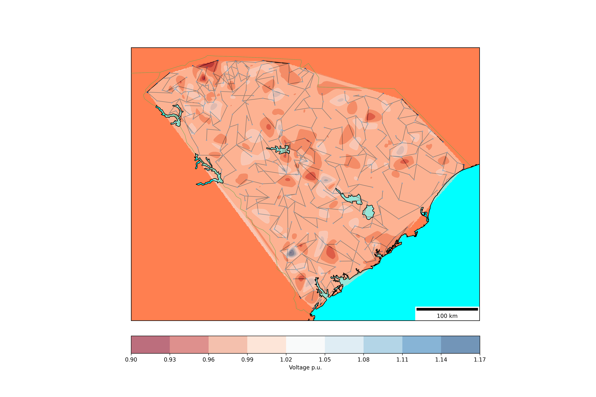

Q: 怎么解耦的? client怎么准备自己的执行环境?
> A: 笔者使用消息队列 (kafka). 使用消息队列动机:
- 这个系统中因为计算的复杂性, **生成**比**验证**慢太多了 (至少100倍的差距), 因此笔者希望有多个server作为生产者 (因为数据空间的巨大, 几乎不可能出现"撞车"的现象), 尽量能填满一个消费者.
- 实际上电网存在一定的"区域性": 如美国德州是一个相对独立的电网单元 (即ERCOT, [参见](https://www.powermag.com/what-is-ercot-and-what-does-it-do/)), 因此电网天然有区域性. 让不同的client负责不同的地理区域 (典型的以state为单位), 可以进一步实现更高阶的目标 (**比如收敛失败, 如何在特定节点添加captor bank补偿电容器组以改善电压**, 这个非常困难而且不具备地理迁移性). 这里只需要让client订阅消息队列的特定topic, server发布到特定topic就可以了.

> 执行环境clients各自将matpower打包成docker容器. 容器预置了所有的可执行文件; client自行编写脚本文件, 复制到容器内部, 组合调用容器内的可执行文件. client从消息队列中pull的数据也迁移到容器内脚本可知的, 约定的数据文件中.

Q: 最终电网的数据结构是什么样的? 怎么存储的?
> A: 为了验证的便利性 (即按照matpower适配的格式), 一张电网, 实际上可以认为是由 (**至少**) 三张表组成:
表一是节点表, $n\times j$, 其中$j$是每个节点的属性数目. 属性包括上面所说的**经纬度**, **电压功率的电气参数**, **电压上下阈值**, **节点类型**等最重要的信息, 以及一系列诸如**所属地理区域**, **并联电导电纳**的参数. $j<20$.
表二是传输线表, $m\times i$, 其中$i$是每个节点的属性数目. 属性包括**连接关系**, **串联复阻抗等电气参数**, **不同时间窗口能承载传输的功率阈值**, 以及一系列诸如**传输线两端相位差阈值**的参数. $i < 25$.
表三是发电节点表, $t \times k$, 其中每个发电节点都首先是节点表中的节点, 但需要维护一些其余的信息. 诸如**有功/无功功率的最大/最小/当前值**, 而且存在一定的约束关系. 如下图见[matpower文档, 74页](./slices/MATPOWER-manual.pdf), 当发电节点有功功率取得$p_{max}$时, 无功功率无法取得理论上的极大值 (即不能取得这个矩形的右侧两个角), 一个简单化处理是如图规定出简化的可行域 (实际的可行域比这个复杂多了), **发电节点表需要维护这样的信息**.
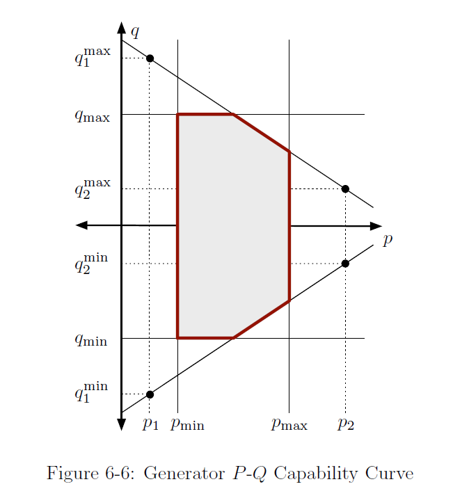
**因此本项目最终用一个json维护完整的电网**. 这个json存在3个key, 每个对应的value就是上述的表.

> 也因为本项目用json存储, 因此数据没有持久化到数据库中. 同时, **对于电网单独修改少数字段, 无法期望有效果** (我们无法期望修改少数字段后, 一个原本通不过验证的电网现在通过验证了), 因此我们认为持久化到nosql数据库如mongodb也是不太有意义的. **最终直接存储在文件系统**.

> client验证成功后会向主server进行post请求. 主要信息包括电网序列化后的sha256摘要. server处理post请求时, 会在mysql数据库中用sha256为主键查询对应的电网条目 (主要信息包括摘要码, 地理区域, 规模, 文件路径, 是否可计算) 元数据, 更新之.
对于能计算的电网就能交付上游任务了.

Q: server端是怎么运行的?
> A: server端进程启动后, 笔者设计了一个简要的命令行界面. 主要就是<命令字符串, 函数指针>的哈希表. **这里借鉴了redis的一些设计**, 处理可变参数的情况.
```Golang
type CommandHandler struct {
	HandlerFunc func(args []interface{})
	ArgCount    int
}

var CommandMap = map[string]CommandHandler{
	"hello":      {HandlerFunc: handleHello, ArgCount: 0},
	"exit":       {HandlerFunc: handleExit, ArgCount: 0},
	"clear":      {HandlerFunc: handleClearScreen, ArgCount: 0},
	"echo":       {HandlerFunc: handleEchoArgs, ArgCount: -1},
	"producenew": {HandlerFunc: handleProduceNew, ArgCount: -2}, // state id, repeat cnt is required.
}
```

```Golang
// 当server成功listen.
<-server_started
reader := bufio.NewReader(os.Stdin)

for {
	// 尝试读取缓冲区直到键入`\n`. 如果长期不键入`\n`, scheduler会调度其他go-routine运行.
	fmt.Print("[server] Enter command: ")
	text, _ := reader.ReadString('\n')
	// command := strings.TrimSpace(text)
	text = strings.TrimSpace(text)
	argv := utils.Sdssplitargs(text)
	if len(argv) < 1 {
		continue
	}

	if handler, exists := CommandMap[strings.ToLower(argv[0])]; exists {
		if handler.ArgCount >= 0 && len(argv)-1 != handler.ArgCount {
			fmt.Printf("wrong args number for command `%s`. expect %v, get %v.\n", argv[0], handler.ArgCount, len(argv)-1)
		} else if handler.ArgCount < 0 && len(argv) < -handler.ArgCount {
			fmt.Printf("wrong args number for command `%s`. expect at least %v, get %v.\n", argv[0], -handler.ArgCount-1, len(argv)-1)
		} else {
			var args []interface{}
			for _, v := range argv[1:] {
				args = append(args, v)
			}
			handler.HandlerFunc(args)
		}
	} else {
		fmt.Println("Unknown command")
	}
}
```

Q: 消息队列组件这么多, 为什么用kafka, 怎么考虑的?
> A: 这个系统中, server和client关心的是消息的"验证", 置于消息被消费的顺序性, 恰好一次性都不重要; 甚至个别消息的丢失也无关紧要: 毕竟server可以 (以较慢的速度) **生成几乎永远不会重复的消息**, 丢了就再生产两个.
这个系统真正重要的, **是生产侧的伸缩性**. topic的数目存在一个比较能遇见的上限, 美国的州级行政区也就 $51$个, 部分州关联密切还能整体考虑, 因此topic的数目不会很大, 而且如果预设一个上界后无需在这方面扩展. 但是**想喂满一个client**, 需要运行好几个server (实际部署中不经压力测试, 也就10个server). 因此从订阅-发布的扩展性角度考虑, kafka是最合适的.